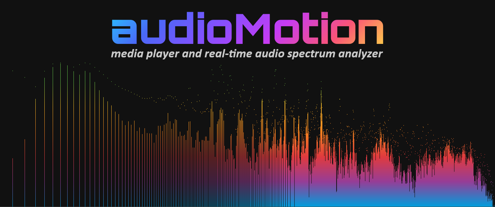
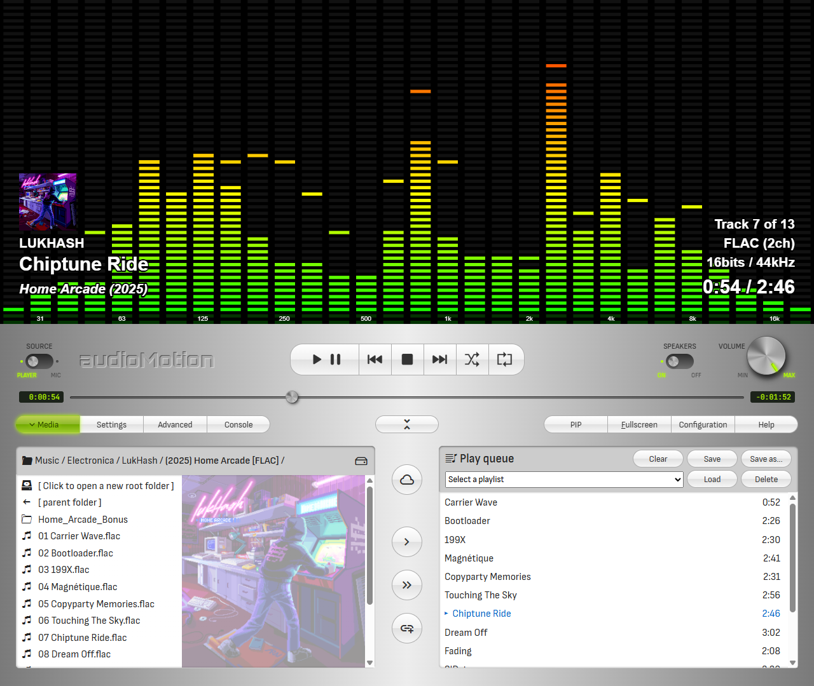

[ ](https://github.com/hvianna/audioMotion.js/releases/latest)

♪♫ **See** your music with **audioMotion**! ♪♫

**audioMotion.js** is a high-resolution real-time audio spectrum analyzer and full-featured music player written in JavaScript.

The spectrum analyzer module is also available as a [standalone project](https://github.com/hvianna/audioMotion-analyzer) and a zero-dependency [npm package](https://www.npmjs.com/package/audiomotion-analyzer) you can use in your own JavaScript projects!

## Features

* High-resolution (retina / HiDPI ready) real-time audio spectrum analyzer
* Fullscreen support at up to 60 frames per second
* Logarithmic frequency scale with customizable range
* Visualize discrete frequencies, or octave bands based on the equal tempered scale
* 10 visualization modes, with optional vintage LED and variable luminance effects
* 17 beautiful color gradients
* Customizable Web Audio API parameters (FFT size, sensitivity and time-smoothing)
* HTML5 audio player for MP3, AAC (M4A), OGG and FLAC files (codec support may vary depending on browser and operating system)
* Visual file explorer and play queue with drag-and-drop functionality
* Support for M3U playlists (`m3u` and `m3u8` file extensions)
* Visualize audio from your microphone (or "stereo mix", if your soundcard supports it)
* Lightweight custom file server — also works on standard web servers with minimal configuration
* Client runs on any modern browser (tested with Firefox, Chrome and Safari)

## Online demo

[DEMO SITE ▶ audioMotion.me/public](https://audiomotion.me/public/)

The demo allows you to play audio files from your PC, load songs and streams from remote URLs and use the microphone input.
The file explorer is not available in the demo, since there are no media files hosted on the demo server.

## Download

Download the latest version from the [releases page](https://github.com/hvianna/audioMotion.js/releases/latest). Portable binaries are available for Windows, Linux and macOS.

Launch audioMotion and you'll be asked for the path to your music folder. Only files under that folder will be accessible to the player.

You can also use the command line argument `-m` to set the music folder when launching audioMotion:

```
audioMotion -m c:\users\john\music
```

This will start the server and should also launch the client in your browser.

The complete command line options are:

```
-m <path> : path to music directory
-p <port> : change server listening port (default is 8000)
-s        : start server only (do not launch client)
-e        : allow external connections (by default, only localhost)
```

## Documentation

+ [User interface](docs/user-interface.md)
+ [Server modes](docs/server.md)
+ [Building audioMotion](docs/building.md)
+ [Legacy features](docs/legacy.md)

For full documentation summary, see the [docs folder](docs/).

## Screenshots

Discrete frequencies mode. User interface showing the file explorer and play queue.


1/12th-octave bands mode with LED effect and on-screen song information. User interface showing the settings panel.


Full screen view: 1/6th-octave bands mode, 30Hz-16KHz, "Outrun" gradient, with complete on-screen information.


Full screen view: Area fill mode, 20Hz-22KHz, frequency scale on, "Rainbow" gradient.


Full screen view: 1/8th-octave bands mode with luminance effect, 30Hz-16KHz, frequency scale on, "Tie Dye" gradient.


## Credits and acknowledgments

**audioMotion** was largely inspired by [Soniq Viewer for iOS](https://itunes.apple.com/us/app/soniq-viewer/id448343005), by Yuji Koike.

### JavaScript libraries

Some of audioMotion's great features are provided by these awesome open-source libraries:

* [express](https://www.npmjs.com/package/express) - fast, unopinionated, minimalist web framework for node
* [music-metadata-browser](https://www.npmjs.com/package/music-metadata-browser) - stream and file based music metadata parser for the browser
* [notie](https://www.npmjs.com/package/notie) - clean and simple notification, input, and selection suite for javascript, with no dependencies
* [open](https://www.npmjs.com/package/open) - open stuff like URLs, files, executables
* [pkg](https://www.npmjs.com/package/pkg) - single-command Node.js binary compiler
* [readline-sync](https://www.npmjs.com/package/readline-sync) - synchronous Readline for interactively requesting user input via console
* [scrollIntoViewIfNeeded 4 everyone](https://gist.github.com/hsablonniere/2581101) - polyfill for non-standard scrollIntoViewIfNeeded() method
* [sortablejs](https://www.npmjs.com/package/sortablejs) - JavaScript library for reorderable drag-and-drop lists
* [webpack](https://www.npmjs.com/package/webpack) - JavaScript module bundler for the browser
  * [mini-css-extract-plugin](https://www.npmjs.com/package/mini-css-extract-plugin) - extracts CSS into separate files
  * [optimize-css-assets-webpack-plugin](https://www.npmjs.com/package/optimize-css-assets-webpack-plugin) - a webpack plugin to optimize / minimize CSS assets
  * [terser-webpack-plugin](https://www.npmjs.com/package/terser-webpack-plugin) - JavaScript compressor

### Graphic resources

* Gradients [*Candy*](https://gradienthunt.com/gradient/172), [*Miami*](https://gradienthunt.com/gradient/950), [*Outrun*](https://gradienthunt.com/gradient/317) and [*Tie Dye*](https://gradienthunt.com/gradient/969) from [Gradient Hunt](https://gradienthunt.com)
* Gradients *Pacific Dream*, *Shahabi*, *Summer* and *Sunset* from [uiGradients](https://uigradients.com)
* Gradients used in the UI buttons from [ColorZilla's Ultimate CSS Gradient Generator](http://www.colorzilla.com/gradient-editor/)
* The audioMotion logo uses the [Orbitron font](https://fonts.google.com/specimen/Orbitron) by Matt McInerney
* Icons provided by [icons8](https://icons8.com) licensed under [Creative Commons Attribution-NoDerivs 3.0 Unported](https://creativecommons.org/licenses/by-nd/3.0/)

### References

These online references were invaluable for the development and improvement of audioMotion:

* [HTML Canvas Reference @W3Schools](https://www.w3schools.com/tags/ref_canvas.asp)
* [Web Audio API documentation @MDN](https://developer.mozilla.org/en-US/docs/Web/API/Web_Audio_API)
* [Web Audio API Specification](https://webaudio.github.io/web-audio-api/)
* [What does the FFT data in the Web Audio API correspond to?](https://stackoverflow.com/a/14789992/2370385)
* [HTML5 check if audio is playing?](https://stackoverflow.com/a/46117824/2370385)
* [Unlocking Web Audio — the smarter way](https://hackernoon.com/unlocking-web-audio-the-smarter-way-8858218c0e09)
* [Equations for equal-tempered scale frequencies](http://pages.mtu.edu/~suits/NoteFreqCalcs.html)
* [Efficient case-insensitive sorting in JavaScript](https://stackoverflow.com/a/40390844/2370385)
* [Fastest way to find the index of a child node in parent](https://stackoverflow.com/a/13657635/2370385)


## License

audioMotion.js copyright (c) 2018-2019 Henrique Avila Vianna<br>
Licensed under the [GNU Affero General Public License, version 3 or later](https://www.gnu.org/licenses/agpl.html).