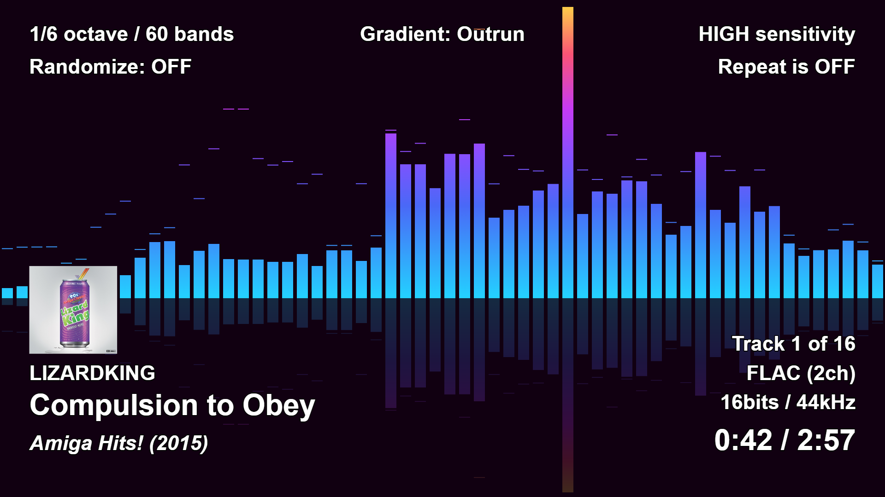

[ ](https://github.com/hvianna/audioMotion.js/releases/latest)

## Features

* Beautiful high-resolution (retina / HiDPI ready) graphic audio spectrum analyzer with fullscreen display
* Logarithmic frequency scale with customizable range
* Visualize discrete frequencies, or octave bands based on the equal tempered scale
* Customizable Web Audio API parameters (FFT size, sensitivity and time-smoothing)
* HTML5 audio player supporting most popular audio formats, like MP3, M4A (AAC), OGG, FLAC (support may vary depending on browser and operating system)
* Visual file explorer and play queue
* Support for M3U and M3U8 playlists
* Visualize audio input from your microphone (or "stereo mix", if your soundcard supports it)
* Lightweight custom web/file server written in node.js — also runs on standard web servers with minimal additional configuration
* Client runs in any modern browser

## Online demo

https://hvianna.github.io/audioMotion.js/

In the demo site you can play individual songs from your PC and also use the microphone input. The file explorer isn't available, since there are no media files on that server.

## Quick start

Download the latest version from the [releases page](https://github.com/hvianna/audioMotion.js/releases/latest). Portable binaries are available for Windows, Linux and macOS.

Launch audioMotion and you'll be asked for the path to your music files. Only files below this folder will be accessible to the player.

You can also use the command line argument `-m` to set the music folder:

```
audioMotion -m c:\users\john\music
```

This will start the server and should also launch the client in your browser.

Other server options are:

```
-p <port> : change server listening port (default is 8000)
-s        : start server only (do not launch client)
-e        : allow external connections (by default, only localhost)
```

For complete documentation, see the [docs folder](docs/).

## Screenshots

audioMotion.js user interface


Full screen view: 1/6th-octave bands mode with LED effect, "Outrun" gradient, showing on-screen information


Full screen view: Discrete frequencies mode, 20Hz-22KHz, 8192-sample FFT, "Classic" gradient


Full screen view: 1/24th-octave bands, 30Hz-16KHz, 16384-sample FFT, "Aurora" gradient


## Third-party resources

* [express](https://www.npmjs.com/package/express) - fast, unopinionated, minimalist web framework for node
* [music-metadata-browser](https://www.npmjs.com/package/music-metadata-browser) - stream and file based music metadata parser for the browser
* [open](https://www.npmjs.com/package/open) - open stuff like URLs, files, executables
* [pkg](https://www.npmjs.com/package/pkg) - single-command Node.js binary compiler
* [readline-sync](https://www.npmjs.com/package/readline-sync) - synchronous Readline for interactively running to have a conversation with the user via a console
* [webpack](https://www.npmjs.com/package/webpack) - JavaScript module bundler for the browser

* Gradients [*Candy*](https://gradienthunt.com/gradient/172), [*Miami*](https://gradienthunt.com/gradient/950), [*Outrun*](https://gradienthunt.com/gradient/317) and [*Tie Dye*](https://gradienthunt.com/gradient/969) from [Gradient Hunt](https://gradienthunt.com)
* Gradients *Pacific Dream*, *Shahabi*, *Summer* and *Sunset* from [uiGradients](https://uigradients.com)
* Gradients used in the UI buttons from [ColorZilla's Ultimate CSS Gradient Generator](http://www.colorzilla.com/gradient-editor/)
* The font used for audioMotion's logo is [Orbitron](https://fonts.google.com/specimen/Orbitron) by Matt McInerney
* Icons by [icons8](https://icons8.com) licensed under [Creative Commons Attribution-NoDerivs 3.0 Unported](https://creativecommons.org/licenses/by-nd/3.0/)

## References and acknowledgments

* audioMotion.js was largely inspired by [Soniq Viewer for iOS](https://itunes.apple.com/us/app/soniq-viewer/id448343005), by Yuji Koike
* [Web Audio API documentation @MDN](https://developer.mozilla.org/en-US/docs/Web/API/Web_Audio_API)
* [Web Audio API Specification](https://webaudio.github.io/web-audio-api/)
* [HTML Canvas Reference @W3Schools](https://www.w3schools.com/tags/ref_canvas.asp)
* [What does the FFT data in the Web Audio API correspond to?](https://stackoverflow.com/a/14789992/2370385)
* [HTML5 check if audio is playing?](https://stackoverflow.com/a/46117824/2370385)
* [Unlocking Web Audio — the smarter way](https://hackernoon.com/unlocking-web-audio-the-smarter-way-8858218c0e09)
* [localStorage polyfill](https://developer.mozilla.org/en-US/docs/Web/API/Web_Storage_API/Local_storage)
* [Equations for equal-tempered scale frequencies](http://pages.mtu.edu/~suits/NoteFreqCalcs.html)

## License

audioMotion.js copyright (c) 2018-2019 Henrique Avila Vianna<br>
Licensed under the [GNU Affero General Public License, version 3 or later](https://www.gnu.org/licenses/agpl.html).