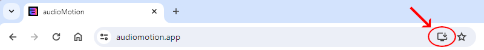

**audioMotion** is a media player and high-resolution real-time audio spectrum analyzer that allows you to **SEE your music!** ♪♫🤩 
It is completely free, open-source software, created out of my passion for the graphic spectrum analyzers of hi-fi systems from the 1980s.

## Features

* Dual channel high-resolution real-time audio spectrum analyzer
* Media player with subtitles support for audio and video files
* Fullscreen and Picture-In-Picture display at 60fps, ready for Retina / HiDPI screens
* Logarithmic, linear and perceptual (Bark and Mel) frequency scales, with customizable range
* Visualization of discrete FFT frequencies or up to 240 frequency bands (supports ANSI and equal-tempered octave bands)
* Decibel and linear amplitude scales, with customizable sensitivity
* Optional A, B, C, D and ITU-R 468 weighting filters
* Optional effects: vintage LEDs, variable opacity, mirroring and reflection, radial spectrum
* 17 beautiful color gradients, plus a visual editor to easily create your own gradients
* Support for M3U playlists (.m3u and .m3u8 file extensions)
* Visualize audio from your microphone (or "stereo mix", if your soundcard supports it)

> **For developers:** 
> Check out [**audioMotion-analyzer**](https://audiomotion.dev) for easy integration of audioMotion's full-featured spectrum analyzer into your own Javascript projects!

## Access the web app

**Use a Chromium-based browser to be able to play media files from your hard drive.** 
Works on Chrome, Opera and Edge by default. On Brave you'll need to enable this feature in `chrome://flags/#file-system-access-api`.

**You can install audioMotion on your PC by clicking the install icon in the browser's address bar, shown below:**

## Documentation

* See the [docs/](docs/) folder or the [online documentation](https://audiomotion.app/docs)

## Contributing

I kindly request that you only [open an issue](https://github.com/hvianna/audioMotion.js/issues) for submitting **bug reports**.

Please use the [**Discussions**](https://github.com/hvianna/audioMotion.js/discussions) section on GitHub to send **feature requests**,
questions, suggestions or any other feedback.

If you'd like to submit a Pull Request, please branch it off the project's `dev` branch - that makes it easier for me to incorporate your changes in a future release.

> Please note that this is a hobby project that I work on in my free time, so it may take me a while to respond to inquiries sometimes.

## License

audioMotion.js copyright (c) 2018-2024 [Henrique Avila Vianna](https://henriquevianna.com) 
Licensed under the [GNU Affero General Public License, version 3 or later](https://www.gnu.org/licenses/agpl.html).
