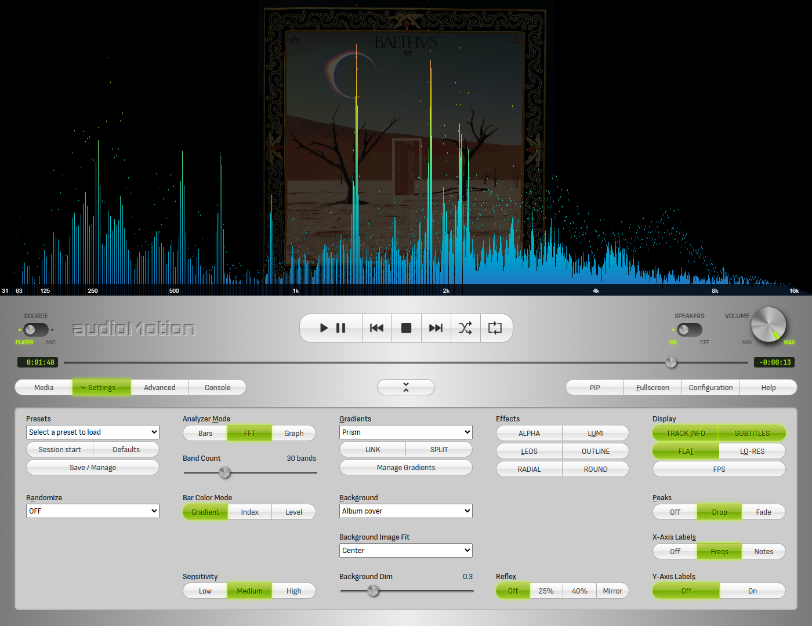
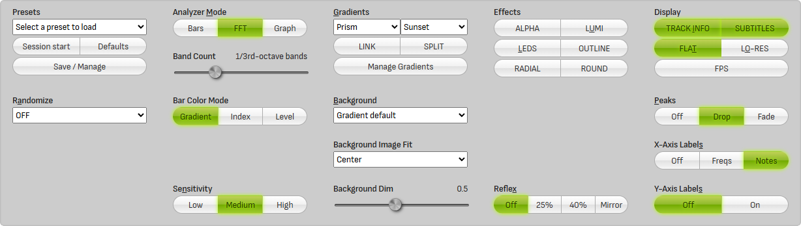

# User Interface

## Main function buttons

- **Settings** - open / close the [Settings](#settings-panel) panel
- **Config** - open the [Config](#config-panel) panel
- **Console** - open / close the message [Console](#console)

- **Fullscreen** - display the spectrum analyzer in fullscreen
- **Controls** - show [keyboard shortcuts](#keyboard-shortcuts) information
- **About** - show the "About" window, with **audioMotion** version and links to the documentation and source code

## Audio source

Move the switch to the **MIC** position to visualize audio from your microphone instead of the music player.
When MIC is selected, the [volume](#volume-control) will be automatically turned all the way down, to prevent feedback loops from the speakers.
If you're using headphones, increase the volume to listen to the microphone audio.

> Please note that microphone access is only allowed in a secure context, i.e., if you're accessing audioMotion on *localhost*, via local file (open index.html file) or HTTPS protocol.

If your sound card supports *Stereo mix* mode, this option may be listed as an input device when access to your microphone is requested.
The *Stereo mix* input allows audioMotion to read audio generated by any program running in your PC.

## Player controls

| button | action |
|:------:|:---------|
|  | Play / pause |
|  | Previous track - Hold to rewind |
|  | Stop playback and reset the queue pointer to the first song |
|  | Next track - Hold to fast forward |
|  | Shuffle queue and start playback |
|  | Play queue on repeat |

## Volume control

Hover the mouse over the volume button and use the mouse wheel to turn the volume up or down.

Volume can also be adjusted with the **Up** and **Down** arrow keys.

## Keyboard shortcuts

The following keyboard shortcuts that can be used to control the player and change some visualization settings without leaving fullscreen:

| key | action |
|:----|:-------|
**Up** / **Down** | volume up / down
**Left** / **Right** | play previous / next song (hold for rewind / fast forward)
**Space** | play / pause
**Shift+A** / **A** | cycle through auto gradient and random mode options
**B** | cycle through Background options
**Shift+B** | cycle through background Image Fit options
**C** | toggle Radial analyzer
**D** | click on analyzer | display song information; press again for settings info and again to hide (alternatively, click on the canvas)
**E** | shuffle play queue
**F** | toggle fullscreen mode
**Shift+G** / **G** | select previous / next gradient
**H** | toggle FPS display
**I** | toggle info display at track start/end
**L** | toggle LED effect on analyzer bars
**Shift+M** / **M** | select previous / next visualization mode
**Shift+N** / **N** | reduce / increase analyzer sensitivity
**O** | toggle low-resolution mode
**P** | toggle peaks display
**R** | toggle play queue repeat
**Shift+S** / **S** | toggle display of frequency and level scales
**T** | toggle flat / shadowed text for on-screen display
**U** | toggle luminance bars effect
**Shift+X** / **X** | select previous / next reflex style

## File explorer and play queue

The file explorer allows you to navigate through the music folder shared by the server.

Supported file extensions are **flac**, **m4a**, **mp3**, **ogg** and **wav** for music files, and **m3u** or **m3u8** for playlists.
Codec support may vary, depending on your web browser and operating system.

Any image file found in the current folder will be shown in the background of the file explorer, giving preference to filenames containing the words *cover*,
*folder* or *front* (in this order).

Double-click a music or playlist file to quickly add it to the queue. Hold *Ctrl* to select multiple files, or *Shift* to select a range of files.

You can drag and drop selected files into the play queue, or use the buttons:

| button | action |
|:-------|:-------|
| **Upload file** | Play any music file from your computer, even if it's not in the shared folder. Uploaded files can't be added to queue or saved to playlists. |
| **Add from URL** | Load a remote audio file or stream from an URL |
| **Add selected** | Add currently selected files in the file explorer to the play queue |
| **Add all files** | Add all files in the current folder to the play queue |

### Using the play queue and playlists

Double-click a queued song to play it.

Drag and drop songs to reorder them inside the queue. Hold *Ctrl* to select multiple files, or *Shift* to select a range.
Press *Delete* (*Backspace* on Mac) to remove selected songs from the queue.

You can save the current play queue by clicking the **Save as...** button. Use the **Clear** button to clear the queue.

Saved playlists are stored locally in your browser and appear in the playlist selection box.

Select a playlist and click one of the buttons:

| button | action |
|:-------|:-------|
|  | Load the selected playlist. Please note that the playlist contents will be **added** to the current queue. |
|  | Update the selected playlist with the current queue contents |
|  | Permanently delete the selected playlist |

## Settings Panel

### Mode

Selects the visualization mode.

+ **Discrete frequencies** mode allows you to visualize individual frequencies provided by the [FFT](https://en.wikipedia.org/wiki/Fast_Fourier_transform);
+ **Area graph** displays the same frequency data as above, but as a filled area graph;
+ **Line graph** connects all the discrete frequency points in a continuous line and allows you to customize the [line width and fill opacity](#line-width-and-fill-opacity);
+ **Octave bands** modes display wider vertical bars, each one representing the *n*th part of an octave, based on a [24-tone equal tempered scale](https://en.wikipedia.org/wiki/Quarter_tone).

You can also select the visualization mode using the **M** and **Shift + M** keyboard shortcuts.

### Random Mode

The visualization mode and some other settings may be randomized on track change or time interval.

If the [AUTO](#gradient) Gradient switch is active, a random gradient will be selected on every mode change.
You can choose which other settings may be changed by random mode in the [Config panel](#config-panel).

### Bar spacing

Bar Spacing can be configured when any [octave bands mode](#mode) is selected. Avaliable options are:

+ Legacy (minimum spacing between analyzer bars);
+ Narrow (10% of bar width) (default);
+ Regular (25% of bar width);
+ Wide (50% of bar width);
+ Extra wide (75% of bar width).

### Line Width and Fill Opacity

These settings are effective only when [Line graph mode](#mode) is selected.

**Line Width** controls the thickness of the graph line, while **Fill Opacity** adjusts the transparency of the graph area.

⚠ On **Firefox**, Fill Opacity may not work properly with [Radial](#radial) analyzer, due to [this bug](https://bugzilla.mozilla.org/show_bug.cgi?id=1164912).

### Gradient

Several options of color gradients for the analyzer graphs. You can also change gradients using the **G** and **Shift + G** keyboard shortcuts.

| switch | action |
|:-------|:-------|
| **AUTO** | select the **next gradient** on each track change, or a **random gradient** on each mode change when [Random mode](#random-mode) is active |
| **SPLIT** | when [Stereo](#switches) is active, splits the gradient between both channels, so each channel will have different colors |

### Effects

Select additional visualization effects for **octave bands modes only.**

| switch | action |
|:-------|:-------|
| **LEDS** | toggle the vintage LED effect for the analyzer bars |
| **LUMI** | toggle the luminance bars effect - all analyzer bars are displayed at full-height, varying their luminance instead |

### Radial

If the **RADIAL** switch is on, the spectrum analyzer is displayed as a circle with radial frequencies. **This mode disables both LEDS and LUMI effects.**

You can also toggle the radial analyzer with the **C** keyboard shortcut.

The **SPIN** slider allows you to configure the analyzer spinning speed, when in radial mode.

### Background

Selects the analyzer background.

- **Gradient default** uses the background color defined by the currently selected gradient - when the [LED effect](#effects) is on, this shows the "unlit" LEDs instead;
- **Black** uses a black background;
- **Album cover** displays the album cover for the current song. See also [Image Fit](#image-fit) and [Image Dim](#image-dim) settings.

You can cycle through the available options using the **B** keyboard shortcut.

Album covers are preferably retrieved from song metadata. When a picture is not found in the metadata, **audioMotion** will look for jpg, png, gif or bmp files
in the song's folder, and will use any image which filename contains the words *cover*, *folder* or *front* (in this order), or the first image found otherwise.

### Image Fit

When [Background](#background) is set to **Album cover**, this option selects the size and positioning of the image.

- **Adjust** - resizes the image so it fills the entire canvas;
- **Center** - displays the image horizontally centered on the canvas (default);
- **Pulse** - makes the image pulsate to the beat of the song;
- **Repeat** - repeats the image horizontally to fill the canvas;
- **Zoom In** - image is initially centered on the canvas and slowly zooms in as the song plays;
- **Zoom Out** - image is initially enlarged at 200% and slowly zooms out as the song plays.

You can cycle through the available options using the **Shift + B** keyboard shortcut.

### Image Dim

When [Background](#background) is set to **Album cover**, this option adjusts the brightness of the background image.

### Reflex

Selects a reflection style for the analyzer. This setting has no effect when the [LUMI](#effects) switch is active.

### Sensitivity

Adjusts the analyzer sensitivity to improve the visualization of songs too quiet or too loud. You can also use the **N** and **Shift + N** keyboard shortcuts.

The presets can be customized in the [Config panel](#config-panel).

### Frequency Range

The lowest and highest frequencies represented in the spectrum analyzer. You can use this feature to "zoom in" a specific frequency range.

### FFT Size

Number of samples used for the [Fast Fourier Transform](https://en.wikipedia.org/wiki/Fast_Fourier_transform) performed by the analyzer.

Higher values provide greater detail in the frequency domain (especially for low frequencies), but less detail in the time domain (slower response to changes),
so you may also want to adjust the [Smoothing](#smoothing) if changing this.

### Smoothing

Average constant used to smooth values between analysis frames.

Lower values make the analyzer react faster to changes, and may look better with faster tempo songs and/or larger [FFT sizes](#fft-size).
Increase it if the animation looks too "jumpy".

### Switches

| switch | action |
|:-------|:-------|
| **SCALEX** | show frequency (Hz) scale on the horizontal axis |
| **SCALEY** | show level (dB) scale on the vertical axis |
| **INFO** | toggle on-screen display of song information on every track change |
| **PEAKS** | show amplitude peaks for each frequency |
| **FLAT** | toggle outline (on) or shadow (off) for text messages displayed on canvas - may improve performance, depending on your graphic card and browser |
| **LO-RES** | reduce canvas resolution to improve rendering speed (especially useful for 4K+ displays) |
| **STEREO** | toggle dual channel display, with separate analyzer graphs for left and right channels. This setting does NOT change the audio output of stereo songs. |
| **FPS** | show current framerate at the top right corner |

### Preset

The **Demo** preset will pick new visualization settings when loaded and will set random mode to 15 seconds, so it's a great way to quickly overview all of audioMotion's features!

**Full resolution**, **LED bars** and **Octave bands** presets provide quick configuration recommendations.

Any changes to the settings will be automatically saved to your browser's [localStorage](https://developer.mozilla.org/en-US/docs/Web/API/Window/localStorage)
and restored the next time you open audioMotion. You can manually load the **Last session** preset to undo any changes made during the current session.

The **Restore defaults** preset resets all options to their initial values, as in the first time you run audioMotion.

Save a favorite configuration in the **Custom** preset, by clicking the **Save** button.

## Console

The console records several useful information, like audio and video settings, configuration changes and error messages.

## Config Panel

### Enabled Modes

Allows you to disable undesired visualization modes. Unchecked modes won't be available for manual selection or random mode.

### Enabled Gradients

Allows you to disable undesired color gradients. Unchecked gradients won't be available for manual selection or random mode.

### Options affected by Random Mode

Customize which configuration settings may be changed when the visualization mode is randomized.

### Sensitivity presets

Customize low, normal and high sensitivity presets. **0** dB represents the loudest possible sound volume.

### On-screen information display options

Customize how long song information is displayed on screen, on different events, and toggle display of albums covers.
