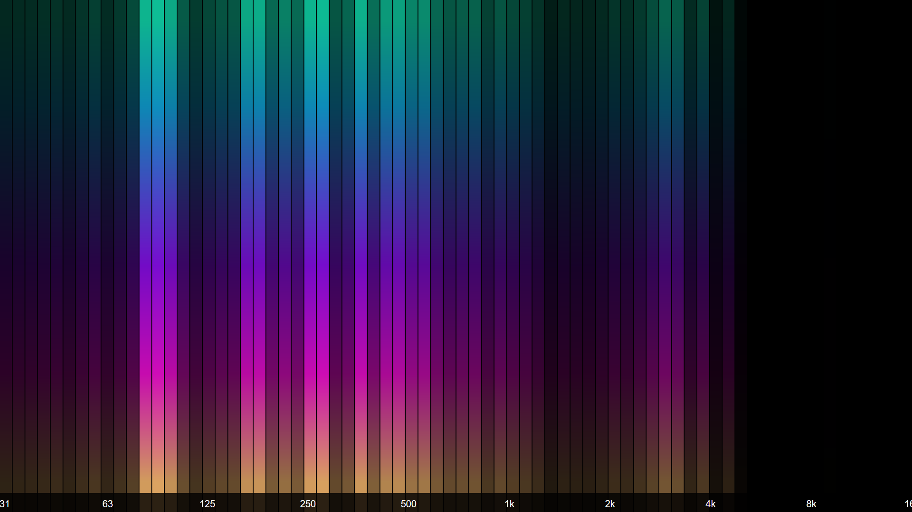

## About


> **audioMotion** is a high-resolution real-time audio spectrum analyzer and full-featured music player that lets you to ♪♫ **see your music!** ♪♫<br>
> It is completely free, open-source software, created out of my passion for the graphic spectrum analyzers of hi-fi systems from the 1980s.

[](https://github.com/hvianna/audioMotion.js/releases/latest)
[](https://github.com/hvianna/audioMotion.js/releases/latest)

## Features

* High-resolution real-time dual channel audio spectrum analyzer
* Fullscreen support at up to 60fps, ready for retina / HiDPI displays
* Logarithmic frequency scale with customizable range
* Visualize discrete frequencies or octave bands based on the equal tempered scale
* Optional effects: vintage LEDs, luminance bars, reflection, radial visualization
* 17 beautiful color gradients
* HTML5 audio player for MP3, AAC (m4a), OGG and FLAC files (support may vary depending on browser and operating system)
* Visual file explorer and play queue with drag-and-drop functionality
* Support for M3U playlists (`m3u` and `m3u8` file extensions)
* Visualize audio from your microphone (or "stereo mix", if your soundcard supports it)
* Lightweight custom file server — also works on standard web servers with minimal configuration
* Client runs on any modern browser (tested on Chrome, Firefox, Opera and Safari)

## For developers

?> Check out [**audioMotion-analyzer**](https://audiomotion.dev) for easy integration of audioMotion's full-featured spectrum analyzer into your own Javascript projects!

## Live demo

?> [**TRY THE LIVE DEMO**](https://demo.audiomotion.me)

The demo site includes a few songs ([credits here](#music-files-used-in-the-demo-site)) and also allows you to play audio files from your PC, load remote files and streams via URL and use the microphone input.

Also check out our [▶ **YouTube channel**](https://audiomotion.me/yt) for some cool songs visualized with audioMotion!

## Getting started

Download the latest version from the [**releases page**](https://github.com/hvianna/audioMotion.js/releases/latest). Portable binaries are available for Windows, Linux and macOS.

Launch audioMotion and you'll be asked for the path to your music folder. Only files under that folder will be accessible to the player.

You can also use the command line argument `-m` to set the music folder when launching audioMotion:

```
audioMotion -m c:\users\john\music
```

This will start the server and should also launch the client in your browser.

The complete command line options are:

```
-b <path> : path to folder with background images and videos
-e        : allow external connections (by default, only localhost)
-m <path> : path to music folder
-p <port> : change server listening port (default is 8000)
-s        : start server only (do not launch client)
```

!> **WARNING:**<br>
Please be aware that using the `-e` flag will expose the contents of the mounted folders to anyone in your network (and potentially to the entire internet!) &mdash; use it only if you're in a trusted network and behind a firewall!

## Screenshots


*[Discrete frequencies](user-interface.md#mode) mode. User interface: [main function buttons](user-interface.md#main-function-buttons), [audio source](user-interface.md#audio-source) selector, [player controls](user-interface.md#player-controls), [volume control](user-interface.md#volume-control) and [file explorer](user-interface.md#file-explorer-and-play-queue).*

---


*1/4th-octave bands with LED effect, extra wide [bar spacing](user-interface.md#bar-spacing) and on-screen song information. User interface shows the [settings panel](user-interface.md#settings-panel) open.*

---


*Fullscreen view: 1/6th-octave bands, regular bar spacing, "Outrun" gradient, [Reflex](user-interface.md#reflex) effect and complete on-screen information.*

---


*Fullscreen view: [Stereo](user-interface.md#switches) Line graph, frequency and level scales on, "Rainbow" gradient.*

---


*Fullscreen view: 1/8th-octave bands, [LUMI effect](user-interface.md#effects) on, "Tie Dye" gradient.*

---


*Fullscreen view: 1/6th-octave bands, [Radial](user-interface.md#radial) analyzer, frequency scale on, "Apple ][" gradient.*

## Documentation

* [User Interface](user-interface.md)
* [Server modes](server.md)
* [Building audioMotion](building.md)
* [Legacy features](legacy.md)


## Credits and acknowledgments

**audioMotion** was largely inspired by [Soniq Viewer for iOS](https://itunes.apple.com/us/app/soniq-viewer/id448343005), by Yuji Koike.

### JavaScript libraries

Some of audioMotion's great features are provided by these awesome open-source libraries:

* [buffer](https://www.npmjs.com/package/buffer) - Node.js Buffer API, for the browser
* [express](https://www.npmjs.com/package/express) - fast, unopinionated, minimalist web framework for node
* [music-metadata-browser](https://www.npmjs.com/package/music-metadata-browser) - stream and file based music metadata parser for the browser
* [notie](https://www.npmjs.com/package/notie) - clean and simple notification, input, and selection suite for javascript, with no dependencies
* [open](https://www.npmjs.com/package/open) - open stuff like URLs, files, executables
* [pkg](https://www.npmjs.com/package/pkg) - single-command Node.js binary compiler
* [process](https://www.npmjs.com/package/process) - process information for node.js and browsers
* [readline-sync](https://www.npmjs.com/package/readline-sync) - synchronous Readline for interactively requesting user input via console
* [scrollIntoViewIfNeeded 4 everyone](https://gist.github.com/hsablonniere/2581101) - polyfill for non-standard scrollIntoViewIfNeeded() method
* [serve-index](https://www.npmjs.com/package/serve-index) - serve directory listings
* [sortablejs](https://www.npmjs.com/package/sortablejs) - JavaScript library for reorderable drag-and-drop lists
* [webpack](https://www.npmjs.com/package/webpack) - JavaScript module bundler for the browser
  * [css-loader](https://www.npmjs.com/package/css-loader) - CSS loader module for webpack
  * [css-minimizer-webpack-plugin](https://www.npmjs.com/package/css-minimizer-webpack-plugin) - cssnano plugin for Webpack
  * [mini-css-extract-plugin](https://www.npmjs.com/package/mini-css-extract-plugin) - extracts CSS into separate files

### Graphic resources

* The font used in audioMotion's logo is [Orbitron](https://fonts.google.com/specimen/Orbitron) by Matt McInerney
* Icons provided by [icons8](https://icons8.com) licensed under [Creative Commons Attribution-NoDerivs 3.0 Unported](https://creativecommons.org/licenses/by-nd/3.0/)
* [Mouse scroll icon](https://thenounproject.com/term/mouse-scroll/628146/) by Viktor Ostrovsky, licensed under [Creative Commons CCBY](https://creativecommons.org/licenses/by/3.0/us/legalcode)
* Gradients [*Candy*](https://gradienthunt.com/gradient/172), [*Miami*](https://gradienthunt.com/gradient/950), [*Outrun*](https://gradienthunt.com/gradient/317) and [*Tie Dye*](https://gradienthunt.com/gradient/969) from [Gradient Hunt](https://gradienthunt.com)
* Gradients *Pacific Dream*, *Shahabi*, *Summer* and *Sunset* from [uiGradients](https://uigradients.com)
* The *Apple ][* gradient was created based on [this post](https://creativemarket.com/blog/6-famous-logos-with-great-color-schemes) by Creative Market
* Gradients used in the UI buttons are from [ColorZilla's Ultimate CSS Gradient Generator](http://www.colorzilla.com/gradient-editor/)
* [CSS3 inset text shadow](https://codepen.io/adambundy/pen/HtmaK) by Adam Bundy
* [CSS slider switches](https://codepen.io/billyysea/pen/CHmiE) by Billy
* Radial brushed metal texture taken from [this pen](https://codepen.io/GreenSock/pen/gnoDc) by GreenSock
* Volume knob design based on [Dark dial](https://codepen.io/stormwarning/pen/yNGeMm) by Jeff
* Warp Tunnel effect based on [this pen](https://codepen.io/trangthule/pen/vYmpNYR) by bytrangle

### Music files used in the demo site

* ["Funky Chunk"](https://incompetech.com/music/royalty-free/index.html?isrc=USUAN1500054) by [Kevin MacLeod](https://incompetech.com) - Licensed under [Creative Commons: By Attribution 3.0 License](https://creativecommons.org/licenses/by/3.0/)
* ["Spell"](https://archive.org/details/Straw_Fields-8753) by [Rolemusic](http://rolemusic.sawsquarenoise.com/) - Licensed under [Creative Commons: By Attribution NonCommercial ShareAlike 3.0 US License](https://creativecommons.org/licenses/by-nc-sa/3.0/us/)
* ["The Factory"](https://archive.org/details/The_Factory-3613) by [Multifaros](http://multifaros.info.se/) - Licensed under [Creative Commons: By Attribution 3.0 US License](https://creativecommons.org/licenses/by/3.0/us/)
* ["We Come Together"](https://archive.org/details/ShMusic-DigitalMemories) by [Lukhash](https://lukhash.com) - Licensed under [Creative Commons: By Attribution NonCommercial NoDerivatives 3.0 License](https://creativecommons.org/licenses/by-nc-nd/3.0/)

### References

These online references were invaluable for the development and improvement of audioMotion:

* [HTML Canvas Reference @W3Schools](https://www.w3schools.com/tags/ref_canvas.asp)
* [Web Audio API documentation @MDN](https://developer.mozilla.org/en-US/docs/Web/API/Web_Audio_API)
* [Web Audio API Specification](https://webaudio.github.io/web-audio-api/)
* [What does the FFT data in the Web Audio API correspond to?](https://stackoverflow.com/a/14789992/2370385)
* [HTML5 check if audio is playing?](https://stackoverflow.com/a/46117824/2370385)
* [Unlocking Web Audio — the smarter way](https://hackernoon.com/unlocking-web-audio-the-smarter-way-8858218c0e09)
* [Equations for equal-tempered scale frequencies](http://pages.mtu.edu/~suits/NoteFreqCalcs.html)
* Pure CSS modal windows based on [this pen](https://codepen.io/timothylong/pen/HhAer) by Timothy Long and [CSS Modal](https://drublic.github.io/css-modal/) by Hans Christian Reinl

## License

audioMotion.js copyright (c) 2018-2021 [Henrique Avila Vianna](https://henriquevianna.com)<br>
Licensed under the [GNU Affero General Public License, version 3 or later](https://www.gnu.org/licenses/agpl.html).

---

This website is powered by [GitHub Pages](https://pages.github.com/), [docsify](https://docsify.js.org/) and [docsify-themeable](https://jhildenbiddle.github.io/docsify-themeable).
