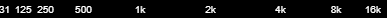

# Advanced Panel

Click **Advanced** in the panel selection buttons to open the Advanced Panel.

## Channel Layout

Selects single or dual channel display, with different layout options:

| Channel Layout | Description |
|----------------|-------------|
| **Single**     | Single channel analyzer, representing the combined output of all channels (stereo or surround).
| **Comb**       | Dual channel analyzer, both channels overlaid. Works best with [**Line Graph** mode](settings.md#analyzer-mode) or [**OUTLINE**](settings.md#effects) switch on.
| **Horiz**      | Dual channel, side by side - see [Mirror](settings.md#mirror) for additional layout options.
| **Vert**       | Dual channel, left channel at the top half of the canvas and right channel at the bottom.

The channel layout setting does NOT affect stereo audio output.

?> Surround audio output is currently only supported with **Single** channel layout, and must be enabled in [Configuration > General settings](configuration.md#general-settings).

## Mirror

Selects a horizontal mirroring effect to the left (low frequencies at the center) or to the right (high frequencies at the center).

| Mirror: Left | Mirror: Right |
|:-----------:|:-------------:|
|  | 

## Import / Export Settings

Click **Export** to download all current settings in the **Settings** and **Advanced** panels as a JSON file. Use it to [share](https://github.com/hvianna/audioMotion.js/discussions/categories/presets) and store backup copies of your favorite settings.

Click **Import** to load settings from an external JSON file. Please note that this will overwrite all current settings in both the **Settings** and **Advanced** panels.

You can also import [downloaded presets](settings.md#save-manage-presets) this way.

## Bar Spacing

The amount of spacing between analyzer bars. This setting is only effective in [Bars mode](settings.md#analyzer-mode).

## Fill Opacity

Transparency of the graph area or bar fill. The [ALPHA](settings.md#effects) switch, when active, has precedence over the Fill Opacity (for Bars mode only).

Effective only for **Graph** [analyzer mode](settings.md#analyzer-mode) or when [OUTLINE](settings.md#effects) switch is on.

!> On **Firefox**, Fill Opacity may not work properly with [Radial](settings.md#effects) analyzer, due to [this bug](https://bugzilla.mozilla.org/show_bug.cgi?id=1164912).

## Line Width

Thickness of the graph line or outline stroke.

Effective only for **Graph** [analyzer mode](settings.md#analyzer-mode) or when [OUTLINE](settings.md#effects) switch is on.

## Radial Size

Configure the radius of the radial analyzer, when [RADIAL](settings.md#effects) switch is on.

## Radial Spin

Configure the radial analyzer spinning speed, when [RADIAL](settings.md#effects) switch is on.

## Frequency Range

The lowest and highest frequencies represented in the spectrum analyzer. You can use this feature to "zoom in" a specific frequency range.

## Frequency Scale

| Scale    | Description | Frequency distribution preview (10Hz - 24kHz range)
|----------|-------------|-----------------------------------
| **BARK** | Bark scale | 
| **LIN**  | Linear scale | 
| **LOG**  | Logarithmic scale | 
| **MEL**  | Mel scale | 

Logarithmic scale allows the visualization of proper **octave bands** (see [Analyzer Mode](settings.md#analyzer-mode)) and it's also recommended when using the [**NOTES**](settings.md#x-axis-label) switch.

[*Bark*](https://en.wikipedia.org/wiki/Bark_scale) and [*Mel*](https://en.wikipedia.org/wiki/Mel_scale) are perceptual pitch scales, which may provide better visualization of mid-range frequencies, when compared to log or linear scales.

## Level Scale

**LINEAR**  | Switch between linear scale and decibels (logarithmic) to represent bar amplitudes

## Octave Bands

**ANSI**    | Switch between [ANSI/IEC preferred frequencies](https://archive.org/details/gov.law.ansi.s1.11.2004) and [equal-tempered scale](http://hyperphysics.phy-astr.gsu.edu/hbase/Music/et.html) to generate octave bands

## FFT Size

Number of samples used for the [Fast Fourier Transform](https://en.wikipedia.org/wiki/Fast_Fourier_transform) performed by the analyzer.

Higher values provide greater detail in the frequency domain (especially for low frequencies), but less detail in the time domain (slower response to changes).
The default value of **8192** usually provides the best cost/benefit ratio for both domains.

## FFT Smoothing

Averaging factor used to smooth FFT data between analysis frames.

Lower values make the analyzer react faster to changes, and may look better with faster tempo songs and/or larger FFT sizes.
Increase it if the analyzer animation looks too "jumpy".

## Weighting Filter

[Weighting filter](https://en.wikipedia.org/wiki/Weighting_filter) applied to frequency data for spectrum visualization.

Each filter applies a different curve of gain/attenuation to specific frequency ranges, but the general idea is to adjust the
visualization of frequencies to which the human ear is more or less sensitive.

?> Weighting filters **do NOT** affect audio output. Some filters may impact performance, due to increased real-time data processing.

