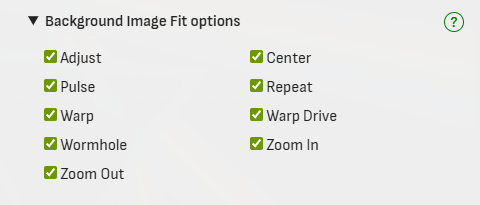
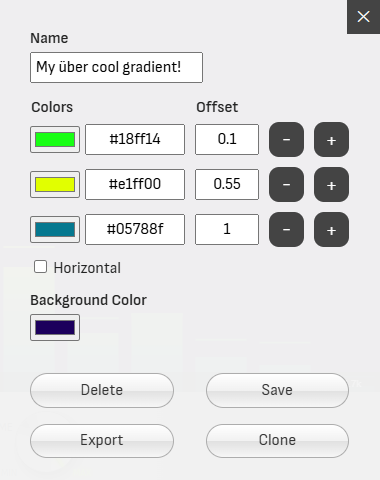
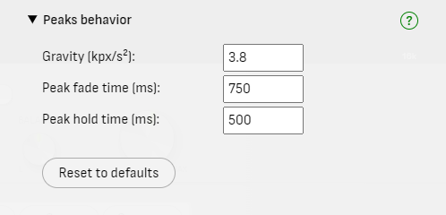
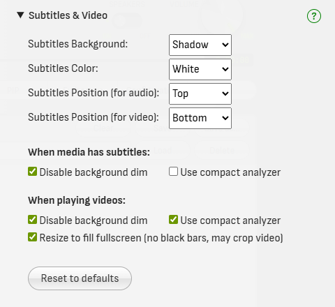

# Configuration

Click **Configuration** in the main function buttons to open the Configuration panel.

## Background Image Fit options

Uncheck options to remove them from the [Background Image Fit](settings.md#background-image-fit) selection box in the Settings panel.

## General settings

### Analyzer height on fullscreen

Height of the fullscreen analyzer (% of screen height). This can be used to provide a wider look to the fullscreen analyzer.

Optionally, use the **Shift** + **Up** and **Down** arrows to adjust the analyzer height during fullscreen visualization.

### Auto-collapse front panel on analyzer hover

Automatically collapses the front panel when you move the mouse cursor over the analyzer area,
keeping only the main controls visible and expanding the analyzer to use most of the screen.

To expand the front panel again, click the  button or one of the [panel selection buttons](user-interface.md#panel-selection).

### Background media source

Choose the source for [Background](settings.md#background) images and videos, or disable this feature.

When set to *Local folder*, only files in the selected folder will be loaded (subfolders are ignored).
Requires browser support for the [*File System Access API*](known-issues.md).

### Background media max items

Choose the maximum number of media files that can be directly selected in the [Background](settings.md#background) setting.

If your backgrounds folder contains more files, the remaining ones will only be selectable via the *Random image* or *Random video* options.

### Enable 5.1 surround audio output (experimental)

Checking this option will enable 5.1 surround audio output, if your system supports it. When disabled, all audio will output in stereo (2 channels).

At the moment, this feature only works properly with **Single** [Channel Layout](advanced.md#channel-layout). Any dual-channel layout selection will force audio to be downmixed to stereo.

You can find the information of how many audio channels the app detects in your device, and how many are in use, in the [Console](console.md) messages.

I have limited hardware to test this on, so I'd appreciate any feedback you can share in the [project's Discussions](https://github.com/hvianna/audioMotion.js/discussions) on whether it works for you.

### Invert scroll direction for Volume control

Check this box to invert the scroll direction when using the mouse wheel to control the [Volume](user-interface.md#speakers-and-volume).

### Maximum frame rate (FPS)

Maximum desired animation frame rate, in frames per second.

*'Unlimited'* will try to match your monitor's refresh rate, but may increase CPU usage.

### PIP aspect ratio

Choose the aspect ratio of the [Picture-In-Picture](user-interface.md#picture-in-picture-pip) window.

After entering PIP, the window can be resized and the selected aspect ratio will be preserved.

### Preserve filenames as is in the play queue

Checking this box will make all entries in the play queue show the full filename, instead of only the song title.

### Remember last music folder

Start the file explorer in the last previously used folder the next time you open audioMotion.

### Remember play queue contents

Automatically restores the contents of the play queue the next time you open audioMotion.

## Gradients management

Uncheck gradients to remove them from the [Gradients](settings.md#gradients) selection box in the Settings panel.

Move the mouse over a gradient name and click the  button to clone, edit, delete, or export it (see [**Gradient Editor**](#gradient-editor) below).

Click the **Create Gradient** button to create a new custom gradient, or the **Import Gradient** button to import a downloaded gradient.

?> Visit [Resources > Gradients](https://github.com/hvianna/audioMotion.js/discussions/categories/gradients) in our GitHub Discussions to download community gradients and share your creations too!

## Gradient Editor

The gradient editor is accessed via [Gradients management](#gradients-management), by clicking the **Create Gradient** button, or the  button next to a gradient's name.

Built-in gradients can't be changed or deleted, but you can clone a built-in gradient and make the changes you'd like. Then disable the built-in gradients you don't want to use by unchecking them in the [Gradients management](#gradients-management) list.

At least two colors are required to create a gradient, but you can add as many colors as you like.
The **offset** must be a number between 0 and 1 - use it to adjust the position of each color inside the gradient.

!> Custom gradients are saved to the browser's internal storage and will only be accessible in the same browser they were saved. **It is recommended that you save backup copies of your custom gradients, by using the Export function.**

## On-screen information display

Select the base font size for information displayed on the analyzer area.

Customize how long information is displayed on screen when user clicks the analyzer, or presses the **D** key,
and also on song beginning and end.

You can also toggle the display of album covers and number of tracks.

## Peaks behavior

### Gravity

Acceleration for peaks falling down (in thousands of pixels per second squared), when [set to *Drop*](settings.md#peaks).

### Peak fade time

Time in milliseconds for peaks to completely fade out, when [set to *Fade*](settings.md#peaks).

### Peak hold time

Time in milliseconds for peaks to hold their values before they start falling down or fading out.

## Randomize

Select which configuration settings may be changed by [Randomize](settings.md#randomize).

When **User Presets** is checked, Randomize will first load one of your [saved custom presets](settings.md#save-manage-presets) and then choose random values for any additional settings checked.

## Sensitivity presets

Customize low, medium and high [Sensitivity](settings.md#sensitivity) presets.

**Min dB** and **Max dB** represent the lowest and highest volume levels to be registered by the analyzer, in decibels.

The **Linear boost** value is used to perform an *n*th-root operation to amplify low energy values, when using the linear [level scale](advanced.md#level-scale).

?> Please note that **0** dB represents the loudest volume possible.

## Subtitles & Video

Choose the background, text color and vertical position of the subtitles. Positions can be configured independently for audio and video tracks.

### Disable background dim

Enable these options to make the player ignore the [Background Dim](settings.md#background-dim) setting when playing a video or showing subtitles for a track — whether it's audio or video.

### Resize videos to fill fullscreen

When enabled, videos playing in fullscreen will be scaled to fill the entire screen. This helps eliminate black bars when the video's aspect ratio differs from the screen's, but part of the image may be cropped.

### Use compact analyzer

The compact analyzer is a reduced-height version of the analyzer positioned below the subtitles/video area, so as not to interfere with the content, as shown below.

