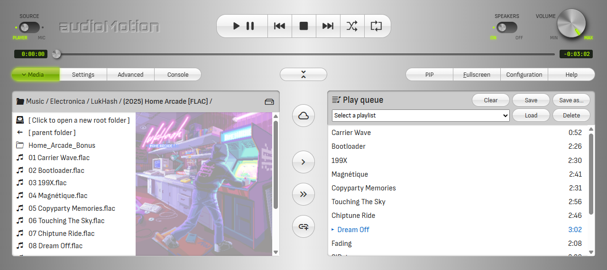
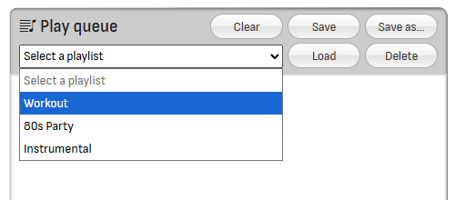

# Media Panel

Click **Media** in the panel selection buttons to open the Media Panel.


The Media Panel is comprised of the **File Explorer** on the left side, the action buttons at the center, and the **Play Queue** on the right.



## Supported file formats

+ Audio: **flac**, **m4a**, **mp3**, **ogg** and **wav**;
+ Video *(for playback and [Background](#background))*: **mkv**, **mpg**, **webm**, **mp4**, **avi** and **mov**;
+ Images *(for folder covers and [Background](#background))*: **jpg**, **jpeg**, **webp**, **avif**, **png**, **gif** and **bmp**;
+ Playlists *(see [Playlist files](#playlist-files))*: **m3u** and **m3u8**;
+ Subtitles *(see [Subtitles](#subtitles))*: **vtt**.

*Actual codec support may vary, depending on browser and operating system.*

## File Explorer

The **File Explorer** allows you to navigate through your media folders and files.

!> Access to files in your device is provided by the [File System Access API](https://caniuse.com/native-filesystem-api),
which is currently **implemented only on Chromium-based browsers** (e.g., Chrome, Opera and Edge).
On **Brave browser** it needs to be enabled in `chrome://flags/#file-system-access-api` (copy and paste it in the address bar).

**Double-click** a file to quickly add it to the play queue. It will also start playing if the player is currently stopped.

Hold **Ctrl** and click to select multiple files, or **Shift** + click to select a range of contiguous files.

You can then **drag and drop** the selected files into the play queue, or use the action buttons:

| button | action |
|:------:|:-------|
 | Switch between browsing folders on your local device or hosted on the app server
  | Add currently selected files in the file explorer to the play queue
 | Add all files in the current folder to the play queue
  | Add a remote audio file or stream from an URL
     | Open and play a single media file from your device<br>*(Only displayed if the browser/device does NOT support the File System Access API)*

?> The first image found in the current folder will be shown in the background of the file explorer, with precedence given to filenames containing the words *cover*,
*folder* or *front* (in this order).

## Play queue and saved playlists

**Double-click** a queued song to play it.

Click a queue entry to select it (use Ctrl/Shift to select multiple files). Drag-and-drop selected entries to reorder them inside the queue.

Press **Delete** (*Backspace* on Mac) to remove selected entries from the queue.

Click the **Clear** button to clear the play queue.

The play queue is automatically restored the next time you open audioMotion. You can disable this feature in [Configuration > General settings](#general-settings).

**You can save the play queue to internal playlists for quick access.**

Saved playlists appear in the playlist selection box, as shown below:



Create and manage your playlists using the following buttons:

| Button | Action |
|:-------|:-------|
**Save as...** | Saves the current queue contents to a new playlist
**Save**       | **Update the selected playlist** with the current queue contents
**Load**       | Load the selected playlist, **adding** its contents to the end of the current queue
**Delete**     | Permanently delete the selected playlist

!> Saved playlists are stored in the browser's internal storage and will only be accessible in the same browser they were saved.

## Playlist files

The File Explorer can load playlist files in M3U format (*.m3u* or *.m3u8* extensions), which are basically text files with one filename per line.

The [Extended M3U format](https://en.wikipedia.org/wiki/M3U#Extended_M3U)'s `#EXTINF` and `#EXTALB` directives are also supported,
and allow adding artist names, album and song titles for media files that don't have embedded metadada.

Playlist entries may include folder names, including `..` to access upper-level folders, but **all paths must be relative to the location of the .m3u file itself,**
i.e., paths **must not** start with a slash or drive letter.

Playlists can also include remote media files and streams, using **https://** protocol.

Example of an .m3u file:

```
#EXTM3U
#
# See https://en.wikipedia.org/wiki/M3U#Extended_M3U for format reference.
#
# Note: EXTALB is applied to all songs that come after it, no need to repeat it.
#
#EXTALB:Animals (1977)
#EXTINF:84,Pink Floyd - Pigs on the Wing. Part 1
track01.mp3
#EXTINF:1025,Pink Floyd - Dogs
track02.mp3
#EXTINF:686,Pink Floyd - Pigs (Three Different Ones)
track03.mp3
#EXTINF:619,Pink Floyd - Sheep
track04.mp3
#EXTINF:85,Pink Floyd - Pigs on the Wing. Part 2
track05.mp3
```

## Subtitles

**audioMotion** can display subtitles in WebVTT format (.vtt), for video and audio files.


**Subtitle files must be in the same folder and have the same base name of its corresponding media file, with a lowercase .vtt extension.**

Media files with detected subtitles will show a **[SUBS]** badge next to their names in the File Explorer, as shown below:


Configure the subtitles appearance in **[Configuration > Subtitles & Video](#subtitles-video).** Toggle the display of subtitles with the [**SUBTITLES** switch](#display).

?> Download synced lyrics for your songs with [LRCGET](https://github.com/tranxuanthang/lrcget) and use [Subtitle Edit](https://github.com/SubtitleEdit/subtitleedit)
to convert them (and other popular subtitle formats) to .vtt.

