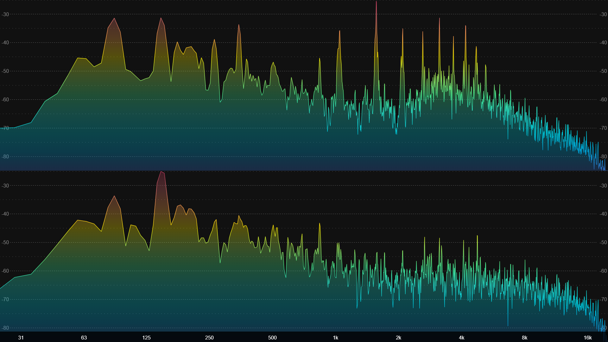
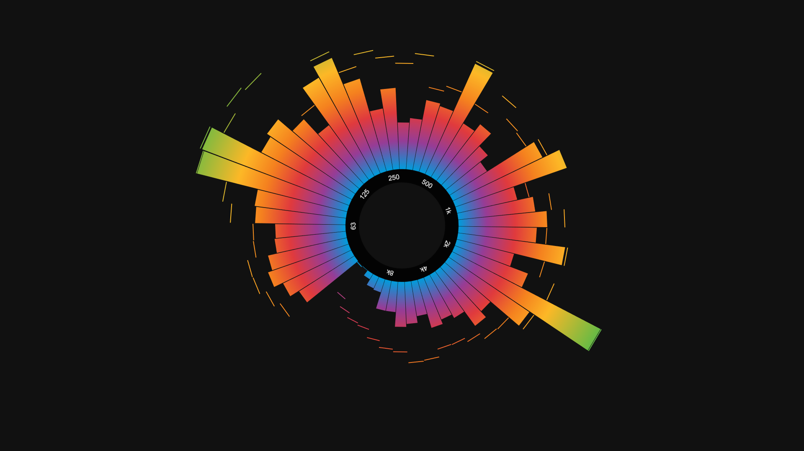

# Screenshots

*User interface showing the analyzer in **Discrete frequencies** mode, player controls, file explorer and play queue.*

*Analyzer set to 1/4th-octave bands mode with LEDs effect, extra wide bar spacing and on-screen song information. The **Settings** panel is shown open below.*

*Fullscreen view: 1/6th-octave bands, regular bar spacing, "Outrun" gradient, Reflex effect and complete on-screen information.*

*Fullscreen view: Area graph mode, "Rainbow" gradient, frequency scale on.*

*Fullscreen view: 1/8th-octave bands, LUMI effect on, "Tie Dye" gradient.*

*Fullscreen view: Line graph, Stereo, frequency and level scales on, "Rainbow" gradient.*

*Fullscreen view: 1/6th-octave bands, **Radial** analyzer, frequency scale on, "Apple ][" gradient.*
