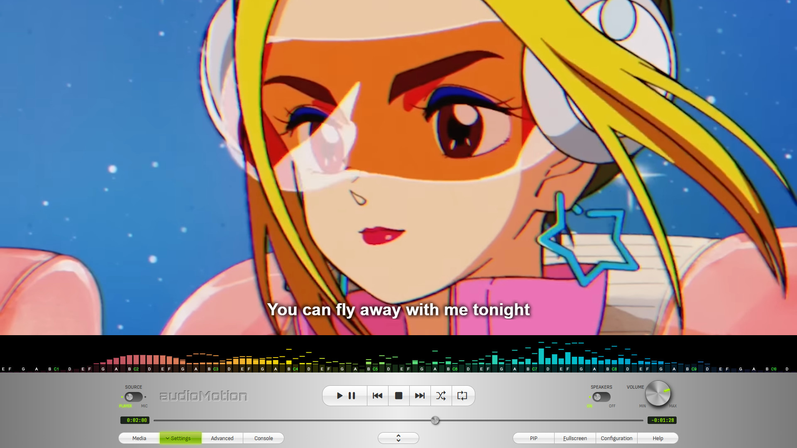

# Screenshots

*User interface showing the analyzer in **FFT** mode with **Bark** frequency scale. Settings panel selected.*

*Analyzer set to 1/3rd-octave bands mode with LEDS effect and on-screen song information. Media panel selected.*

*Video playback with subtitles, collapsed front panel, [compact analyzer](configuration.md#subtitles-amp-video) set to 1/12th-octave bands and Notes labels displayed in the X-Axis.*

*Fullscreen view: 1/6th-octave bands, "Outrun" gradient, Reflex effect and complete on-screen information.*

*Fullscreen view: 1/8th-octave bands, LUMI effect on, "Tie Dye" gradient.*

*Fullscreen view: Line graph, Vertical dual channel layout, frequency and level scales on, "Prism" gradient.*

*Fullscreen view: 1/6th-octave bands, **Radial** analyzer, frequency scale on, "Apple ][" gradient.*
