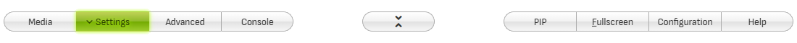

# Settings Panel

Click **Settings** in the panel selection buttons to open the Settings Panel.

Settings are listed below in alphabetical order.

## Analyzer Mode

Selects the visualization mode. Keyboard shortcut: **M** / **Shift + M**.

| Analyzer&nbsp;Mode | Description |
|------|-------------|
| **Bars** | Displays bars of equal width, representing frequency bands, as selected by [**Band Count**](#band-count).
| **FFT** | Displays individual discrete frequencies, as provided by the [FFT](https://en.wikipedia.org/wiki/Fast_Fourier_transform) computation.
| **Graph** | Uses the FFT data points to create an area or line graph - [**Line Width**](advanced.md#line-width) and [**Fill Opacity**](advanced.md#fill-opacity) can be customized in the Advanced panel.

## Background

Selects the analyzer background.

| Background | Description |
|------------|-------------|
| **Gradient default** | Uses the background color defined by the currently selected gradient - when the [LEDs effect](#leds) is on, this shows the "unlit" LEDs instead |
| **Black** | Uses a black background |
| **Album cover** | Displays the album cover for the current song (1) |
| **Random image** | Selects a random image from the backgrounds folder (2) |
| **Random video** | Selects a random video from the backgrounds folder (2) |

**( 1 )** Album covers will be preferably retrieved from the file's metadata. When a picture is not found in the metadata, **audioMotion** will look for image files
in the song's folder, and will pick any image which filename contains the words *cover*, *folder* or *front* (in this order), or the first image found otherwise.

**( 2 )** The web app includes a few built-in background images and videos. **You can select your own backgrounds folder in [Configuration > General settings](configuration.md#background-media-source).**
You can also customize [how many files will be directly available](configuration.md#background-media-max-items) in the selection box, but for large amounts of files use the *Random image* and *Random video* options to randomly choose among **all** files found in the backgrounds folder.

See also [Background Image Fit](#background-image-fit) and [Background Dim](#background-dim) settings for additional options for background images and videos.

You can cycle through the available options using the **B** keyboard shortcut.

?> **When a video file is loaded on the player** the Background setting has no effect, but you can still adjust the [Background Dim](#background-dim).

## Background Dim

Adjusts the brightness of images and videos shown in the background of the spectrum analyzer.

**By default, Background Dim is disabled when playing a video track or displaying subtitles.** Configure it in [Configuration > Subtitles & Video](configuration.md#subtitles-amp-video).

## Background Image Fit

Selects the size and positioning of the background image. Keyboard shortcut: **Shift + B**.

Effective only when [Background](#background) is set to an image or **Album cover**.

| Background Image Fit | Effect |
|----------------------|--------|
**Adjust** | Resizes the image so it fills the entire canvas
**Center** | Displays the image horizontally centered on the canvas (default)
**Pulse** | Makes the image pulsate to the beat of the song
**Repeat** | Repeats the image horizontally to fill the canvas
**Warp** | Applies a 3D "warp" effect to the background image
**Warp Drive** | Animated *Warp* effect
**Wormhole** | *Warp Drive* effect with additional rotation
**Zoom In** | Image is initially centered on the canvas and slowly zooms in as the song plays
**Zoom Out** | Image is initially enlarged at 200% and slowly zooms out as the song plays

Effects can be selectively disabled in [Configuration > Background Image Fit](configuration.md#background-image-fit-options).

!> The **Warp Drive** and **Wormhole** effects may degrade performance on some graphics cards.

## Band Count

How many frequency bands should be displayed in [**Bars** mode](#analyzer-mode), or how much of an octave should each band represent.

When [Frequency Scale](advanced.md#frequency-scale) is set to **Log**, this setting defines which fraction of an octave is included in each bar.
Otherwise, the frequency spectrum is divided into a fixed amount of bars, with the bandwidth of each bar varying according to the selected frequency scale.

## Bar Color Mode

Desired method for coloring the analyzer bars. This setting has no effect in [**Graph** mode](#analyzer-mode).

| Color&nbsp;Mode | Description | Preview ('prism' gradient)
|-----------------|-------------|----------------------------
| **Gradient**    | Analyzer bars are painted with the currently selected [Gradient](#gradients). | 
| **Index**       | Each analyzer bar is painted with a **single color** from the selected gradient, starting with the first color applied to the first bar, and so on, cycling through the available colors. | 
| **Level**       | Colors from the selected gradient are used to paint each bar, according to its current level (amplitude). | 

## Display switches

### TRACK INFO

Toggle display of on-screen information on track start and end, as configured in [Configuration > On-screen information display](configuration.md#on-screen-information-display).

### SUBTITLES

Toggle display of [subtitles](media-panel.md#subtitles).

### FLAT

Switch between outlined (on) or shadowed (off) text for messages displayed on screen.

### LO-RES

Toggle low resolution mode *(may improve performance, especially on 4K+ displays)*.

### FPS

Toggle display of current frame rate at the top right corner.

## Effects switches

### ALPHA

Toggle dynamic bar transparency - when active, bars become more opaque as their amplitude increases.

### LUMI

Toggle luminance bars - similar to ALPHA, bars' opacity vary according to their level, but all bars are displayed at full height *(no effect with RADIAL)*.

### LEDS

Toggle LED effect for the analyzer bars *(Bars mode only, no effect with RADIAL)*.

### OUTLINE

Toggle bar outline - see [Line Width](advanced.md#line-width) and [Fill Opacity](advanced.md#fill-opacity) settings *(Bars mode only)*.

### RADIAL

Toggle display of circular spectrum analyzer with radial bars. **This option disables both LEDS and LUMI effects.**

### ROUND

Toggle rounded corners at the top of analyzer bars *(Bars mode only)*.

## Gradients

Select color gradients for left and right analyzer channels. Keyboard shortcut: **G** / **Shift + G**.

Button / switch | Description
----------------|------------
**LINK**        | When active and using a dual [Channel Layout](advanced.md#channel-layout), uses the same gradient for both channels.
**SPLIT**       | When active, splits gradient colors between both channels (**Vertical** [channel layout](advanced.md#channel-layout) only).
**Manage Gradients** | Click to create, edit, import and export gradients - see [Configuration > Gradient management](configuration.md#gradient-management).

## Peaks

Toggle display of level peaks.

Peaks | Description
------|-------------
Off   | Do not show level peaks
Drop  | Peaks fall down after a short time
Fade  | Peaks fade out after a short time

Drop and Fade behavior can be customized in [Configuration > Peaks behavior](configuration.md#peaks-behavior).

## Presets

**audioMotion comes with 6 built-in presets and provides 9 slots for user-defined presets.**

The **Demo** preset picks random settings and sets [**Randomize**](#randomize) to 15 seconds, so it's a great way to quickly overview all of audioMotion's features!

Description of buttons functions:

Button            | Action
------------------|-----------
**Load**          | Load the selected preset
**Session start** | Restore settings as they were when you last launched (or reloaded) the app
**Defaults**      | Resets all settings to their initial values, as in the first time you run audioMotion
**Save / Manage** | Save, update, rename, delete and download user presets - see [**Save / Manage presets**](#save-manage-presets)

Keyboard shortcuts available:

Key               | Action
------------------|-----------
**0** (zero)      | Choose random values for all settings enabled in [Configuration > Randomize](configuration.md#randomize)
**1 - 9**         | Load the user preset of corresponding slot number
**Shift + 1 - 9** | Save the current settings to the corresponding user preset slot number

Your last used settings will be automatically restored the next time you open audioMotion.

?> NOTE: presets store all settings from both the **Settings** and **Advanced** panels!

### Save / Manage presets

Click the  button to open the list of user presets, as seen below.

Click any empty slot to save the current settings to a new user preset, or click one of the saved presets to update it with the current settings.

Button | Action
-------|--------
 | Rename the corresponding preset
 | Download the corresponding preset
 | Delete the corresponding preset

!> **Download your presets and keep backup copies of them!** User presets are saved to the browser's internal storage and may be lost if you uninstall the browser or clear its data.

External presets can be imported via [**Advanced Panel > Import Settings**](advanced.md#import-export-settings).

## Randomize

Selects random visualization settings on track change or time interval.

You can choose which settings may be changed by Randomize in [Configuration > Randomize](configuration.md#randomize).

## Reflex

Selects a vertical reflection effect. On **Bars** [Analyzer Mode](#analyzer-mode), this setting has no effect when the [LUMI effect](#lumi) is active.

Reflex: 40% | Reflex: Mirror
----------- |-----------------
 | 

## Sensitivity

Adjusts the analyzer sensitivity to improve the visualization of songs too quiet or too loud. Keyboard shortcut: **N** / **Shift + N**.

Presets for low, medium and high sensitivity can be customized in [**Configuration > Sensitivity presets**](configuration.md#sensitivity-presets).

## X-Axis Labels

Toggle display of scale labels on the horizontal axis (frequency). Keyboard shortcut: **S** / **Shift + S**.

X-Axis Labels | Description
--------------|-------------
Off           | Do not show labels
Freqs         | Show the center frequencies of each octave (in Hz)
Notes         | Show musical notation labels

?> For perfect alignment of analyzer bars with Notes labels, use [**Frequency Scale**](advanced.md#frequency-scale): *Log*, [**Octave Bands**](advanced.md#octave-bands): *Tempered* and [**Band Count**](#band-count): *1/12th octave*.

## Y-Axis Labels

Toggle display of scale labels on the vertical axis (level/volume). Keyboard shortcut: **S** / **Shift + S**.
