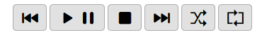
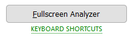
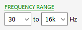

audioMotion.js User Interface
=============================

## Main controls

### Audio source

Select *Microphone* to make audioMotion visualize audio from your microphone.

If your sound card supports *Stereo mix* mode, it should be listed as an input device when access to your microphone is requested.
The *Stereo mix* input allows audioMotion to receive audio generated by other programs running in your PC.
Please note that the graphic visualization from this source might suffer a slight delay.

### Player controls

You can use the player controls to play, pause and skip through songs in the play queue.

The **Shuffle** button will shuffle the songs in the play queue and start playback.

If the **Repeat** option is active, the player will loop back to the first song after playing the entire queue.

### Fullscreen mode and keyboard shortcuts

Click the **Fullscreen Analyzer** button, or press the **F** key, to display the spectrum analyzer in fullscreen.

You can use the keyboard shortcuts below to control the player and change display settings without leaving fullscreen mode:

| keys | alternate | action |
|------|-----------|--------|
**Left** / **Right** | **J** / **K** | play previous / next song
**Space** | | play / pause
**Up** / **Down** | **Shift+G** / **G** | select previous / next gradient
**A** | | toggle auto gradient change
**B** | | toggle background
**D** | | display current song info - press again for settings info
**F** | | toggle fullscreen mode
**H** | | toggle FPS display
**I** | | toggle song info display on track change
**L** | | toggle LED effect on analyzer bars
**Shift+M** / **M** | | select previous / next visualization mode
**Shift+N** / **N** | | reduce / increase analyzer sensitivity
**O** | | toggle low-resolution mode
**P** | | toggle peaks display
**R** | | toggle playlist repeat
**S** | click on analyzer | toggle frequency scale display on/off
**T** | | toggle flat text option
**U** | | shuffle playlist

## Panels

Below the main controls there are three tabbed panels: **Settings**, **Files** and **Console**.

### Settings Panel

#### Preset

The **Full resolution**, **Octave bands** and **LED bars** presets adjust the settings to recommended values for the discrete frequencies and octave bands visualization modes, with optional LED effect mode.

You can tweak any options and save a favorite configuration by clicking the **Save current settings** button. You can later revert to this configuration by selecting the **Custom** preset.

Additionally, your last used configuration will be automatically saved, and restored the next time you open audioMotion.
You can manually select the **Last session** preset to undo any changes made during the current session.

The **Restore defaults** preset resets all options to their initial values as in the first time you run audioMotion.

#### Gradient

Several options of color gradients for the analyzer bars. You can change gradients with the **Up** and **Down** arrow keys, or alternatively, **G** and **Shift + G** keys.

Gradient-related switches:

+ **AUTO** when active, every track change will select the next gradient, cycling through the available options
+ **NO BG** when active, sets a black background for the analyzer, instead of the color defined by each gradient (improves contrast)

#### Analyzer switches

+ **INFO** toggles the on-screen display of song information on every track change
+ **SCALE** toggles the display of the frequency scale on the X-axis; clicking the visualization area also toggles this option
+ **SENS** increases analyzer sensitivity to improve the visualization of songs too quiet
+ **PEAKS** shows volume peaks for each frequency

**Performance-related options:**

+ **FLAT** applies an outline instead of shadow on text displayed on canvas - may improve performance, depending on you graphic card and browser
+ **LO-RES** reduces canvas resolution to improve rendering speed (especially useful for 4K+ displays)
+ **FPS** displays current framerate at the top right corner

The underlined character in each switch label indicates its keyboard shortcut, when available.

#### Mode

Selects the visualization mode. *Discrete frequencies* allows you to visualize individual frequencies, limited only by the resolution of both the [FFT](https://en.wikipedia.org/wiki/Fast_Fourier_transform) and your display.
The *octave bands* modes will display wider bars, representing ranges of frequencies based on a [24-tone equal tempered scale](https://en.wikipedia.org/wiki/Quarter_tone).

You can also select the visualization mode using the **M** and **Shift + M** keyboard shortcuts.

The **LEDS** switch toggles the LED effect applied to the analyzer bars.

#### FFT Size

The number of samples used for the [Fast Fourier Transform](https://en.wikipedia.org/wiki/Fast_Fourier_transform) performed by the analyzer.
Larger values provide greater detail in the frequency domain (especially for low frequencies), but less detail in the time domain (slower response to changes).

#### Range

The lowest and highest frequencies you want to see in the graphic spectrum analyzer. You can use this feature to "zoom in" a specific frequency range.

#### Smoothing

Average constant used to smooth values between analysis frames. Lower values make the analyzer react faster to changes, and may look better with faster tempo songs and/or larger FFT sizes.
Increase it if the animation looks too "jumpy".

#### Sensitivity

Adjust the minimum and maximum decibel values to improve the visualization of songs too quiet or too loud. **0** is the loudest possible sound volume.

You can also choose from three predefined sensitivity settings (low, normal and high) via the **N** and **Shift + N** keyboard shortcuts.

### Files Panel

#### File explorer

The file explorer allows you to navigate through the music folder shared by the server.

Double-click a music file or playlist to quickly add it to the play queue. Press *Ctrl* to select multiple files, or *Ctrl*+*Shift* to select a range of files.

Click the **Add selected** button to add selected files to the play queue, or the **Add all files** button to enqueue all music files in the current folder.

You can also drag and drop files from the file explorer into the play queue.

Supported extensions are flac, m4a, mp3, ogg and wav for music files, and m3u or m3u8 for playlists. Codec support may vary, depending on your web browser and operating system.

#### Play queue and playlists

Double-click a song in the play queue to play it.

You can drag and drop songs inside the play queue to reorder them. Press *Ctrl* to select multiple files, or *Ctrl*+*Shift* to select a range.
Press *Delete* (*Backspace* on Mac) to remove selected songs from the queue.

**Clear** clears the current play queue. **Save as...** saves the current play queue as a new local playlist - these are stored in your browser's local storage.

Saved playlists appear in the playlist selection box. Select a playlist and click the  button to load it into the play queue.
Press the  button to update the selected playlist with the current play queue contents.
Press the  button to permanently deleted the selected playlist.

### Console

The console registers several useful information, like audio and video settings, configuration changes and error messages.
