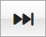
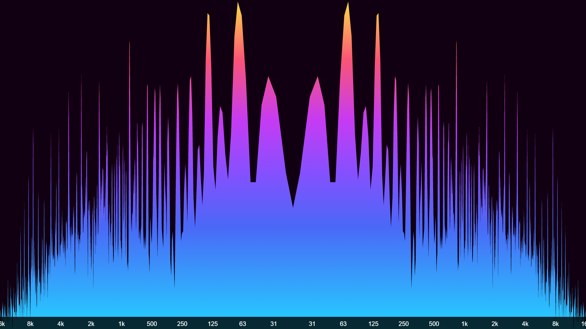
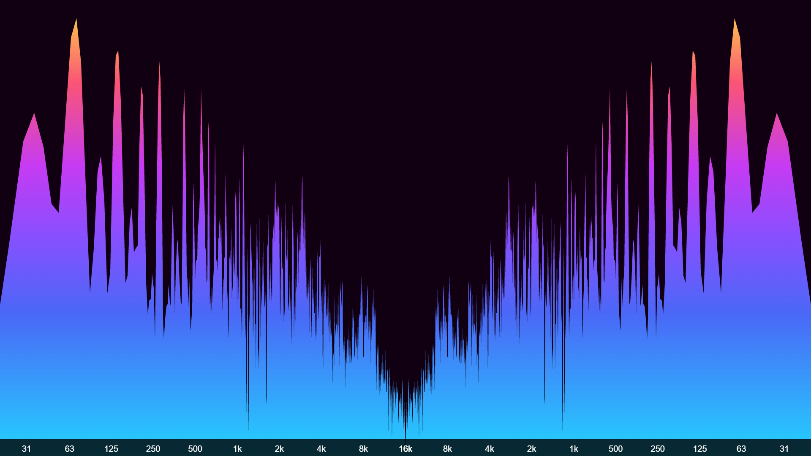

# User Interface

## Top panel buttons

- **Settings** - open / close the [Settings](#settings-panel) panel
- **Config** - open the [Config](#config-panel) panel
- **Console** - open / close the message [Console](#console)

- **PIP** - display the spectrum analyzer in a Picture-In-Picture window (disabled on unsupported browsers)
- **Fullscreen** - display the spectrum analyzer in fullscreen
- **Help** - show **audioMotion** version, documentation links and the [keyboard shortcuts](#keyboard-shortcuts)

## Source and Speakers

Move the Source switch to the **MIC** position to visualize audio from your microphone instead of the music player.
When MIC is selected, the Speakers are automatically turned off to prevent feedback loops from the speakers.
If you're using headphones you can safely turn the Speakers on to listen to the microphone audio.

> Please note that microphone access is only allowed in a secure context, i.e., if you're accessing audioMotion on *localhost*, via local file (open index.html file) or HTTPS protocol.

If your sound card supports *Stereo mix* mode, this option may be listed as an input device when you set the Source to MIC.
The *Stereo mix* input allows audioMotion to read audio generated by any program running in your PC.

## Player controls

| button | action |
|:------:|:-------|
|  | Play / pause |
|  | Previous track - Hold to rewind |
|  | Stop playback and reset the queue pointer to the first song |
|  | Next track - Hold to fast forward |
|  | Shuffle queue and start playback |
|  | Play queue on repeat |

## Balance and Volume

Hover the mouse over the Balance and Volume knobs and use the **mouse wheel** to adjust them.

**Double-click** the Balance knob to center it.

Balance can also be adjusted with **Shift** + **Left** and **Right** arrow keys, and Volume with the **Up** and **Down** arrow keys.

Your volume and balance settings will be automatically restored next time you open **audioMotion**.

## File explorer and play queue

The file explorer allows you to navigate through the music folder shared by the server.

Supported file extensions are **flac**, **m4a**, **mp3**, **ogg** and **wav** for music files, and **m3u** or **m3u8** for playlists.
Codec support may vary, depending on your web browser and operating system.

Any image file found in the current folder will be shown in the background of the file explorer, giving preference to filenames containing the words *cover*,
*folder* or *front* (in this order).

Double-click a music or playlist file to quickly add it to the queue. Hold *Ctrl* to select multiple files, or *Shift* to select a range of files.

You can drag and drop selected files into the play queue, or use the buttons:

| button | action |
|:-------|:-------|
| **Upload file** | Play any music file from your computer, even if it's not in the shared folder. Uploaded files can't be added to queue or saved to playlists. |
| **Add from URL** | Load a remote audio file or stream from an URL |
| **Add selected** | Add currently selected files in the file explorer to the play queue |
| **Add all files** | Add all files in the current folder to the play queue |

### Using the play queue and playlists <!-- {docsify-ignore} -->

Double-click a queued song to play it.

Drag and drop songs to reorder them inside the queue. Hold *Ctrl* to select multiple files, or *Shift* to select a range.
Press *Delete* (*Backspace* on Mac) to remove selected songs from the queue.

You can save the current play queue by clicking the **Save as...** button. Use the **Clear** button to clear the queue.

Saved playlists are stored locally in your browser and appear in the playlist selection box.

Select a playlist and click one of the buttons:

| button | action |
|:-------|:-------|
|  | Load the selected playlist. Please note that the playlist contents will be **added** to the current queue. |
|  | Update the selected playlist with the current queue contents |
|  | Permanently delete the selected playlist |

## Settings Panel

### Mode

Selects the visualization mode.

| Mode | description |
|------|-------------|
**Discrete frequencies** | displays amplitudes of individual frequencies, as provided by the [FFT](https://en.wikipedia.org/wiki/Fast_Fourier_transform) computation
**Area graph** | uses the discrete frequency data points to create a filled area graph
**Line graph** | connects all the discrete data points in a continuous line graph - [line width and fill opacity](#line-width-and-fill-opacity) can be customized
**Octave bands** | groups frequencies in bands, each one representing a full, half or the *n*th part of an octave, depending on the selected option

You can also select the visualization mode using the **M** and **Shift + M** keyboard shortcuts.

### Random Mode

The visualization mode and [several other settings](#settings-affected-by-random-mode) may be randomized on track change or time interval.

If the [AUTO](#gradient) Gradient switch is active, a random gradient will be selected on every mode change.

You can choose which settings may be changed by random mode in the [Config panel](#config-panel).

### Bar spacing

This setting is effective only when an [octave bands mode](#mode) is selected. Avaliable options are:

| Bar Spacing | description |
|-------------|-------------|
**Legacy** | ~1px spacing between analyzer bars
**Narrow** | 10% spacing, 90% bar width (default)
**Regular** | 25% spacing, 75% bar width
**Wide** | 50% spacing, 50% bar width
**Extra wide** | 75% spacing, 25% bar width

### Line Width and Fill Opacity

These settings are effective only for [Line graph mode](#mode) or when [OUTLINE](#effects) effect is on.

**Line Width** controls the thickness of the graph line or bar stroke.

**Fill Opacity** adjusts the transparency of the graph area or bar fill. The [ALPHA](#effects) effect, when active, has precedence over the Fill Opacity (for octave bands modes only).

⚠ On **Firefox**, Fill Opacity may not work properly with [Radial](#radial) analyzer, due to [this bug](https://bugzilla.mozilla.org/show_bug.cgi?id=1164912).

### Gradient

Several options of color gradients for the analyzer graphs. You can also change gradients using the **G** and **Shift + G** keyboard shortcuts.

| Switch | description |
|:-------|:------------|
| **AUTO** | select the **next gradient** on each track change, or a **random gradient** on each mode change when [Random mode](#random-mode) is active |
| **SPLIT** | when [Stereo](#switches) is active, splits the gradient between both channels, so each channel will have different colors |

### Effects

Select additional visualization effects for **octave bands modes.**

| Effect | description | example (on) |
|:-------|:------------|:------------:|
| **LEDS** | toggle the vintage LED effect for the analyzer bars | 
| **LUMI** | toggle the luminance bars effect - all analyzer bars are displayed at full-height, varying their luminance instead | 
| **ALPHA** | toggle varying bar transparency - the higher the bar amplitude the more opaque it is (also works on *Discrete frequencies* mode) | 
| **OUTLINE** | toggle bar outline mode - see [Line width and Fill opacity](#line-width-and-fill-opacity) settings | 

### Radial

If the **RADIAL** switch is on, the spectrum analyzer is displayed as a circle with radial frequencies. **This mode disables both LEDS and LUMI effects.**

You can also toggle the radial analyzer with the **C** keyboard shortcut.

The **SPIN** slider allows you to configure the analyzer spinning speed, when in radial mode.

| Radial Mono | Radial Stereo |
|:-----------:|:-------------:|
|  | 

### Background

Selects the analyzer background.

| Background | description |
|------------|-------------|
| **Gradient default** | uses the background color defined by the currently selected gradient - when the [LED effect](#effects) is on, this shows the "unlit" LEDs instead |
| **Black** | uses a black background |
| **Album cover** | displays the album cover for the current song (1) |
| **Random image** | selects a random image from the backgrounds folder (2) |
| **Random video** | selects a random video from the backgrounds folder (2) |

**( 1 )** Album covers will be preferably retrieved from song metadata. When a picture is not found in the metadata, **audioMotion** will look for image files (jpg, png, gif, webp, avif or bmp)
in the song's folder, and will pick any image which filename contains the words *cover*, *folder* or *front* (in this order), or the first image found otherwise.

**( 2 )** If you use the `-b` option when [starting **audioMotion**](/#getting-started), image and video files in the provided folder
can also be used as background. All media files found in the first level folder (no subfolders) can be selected by the *Random image* or *Random video* options,
and the first 20 files will also be directly available in the selection box.

See also [BG Image Fit](#background-image-fit) and [Background Dim](#background-dim) settings for additional options for background images and videos.

You can cycle through the available options using the **B** keyboard shortcut.

### Background Image Fit

When [Background](#background) is set to **Album cover** or an image, this option selects the size and positioning of the background image.

| BG Image Fit | Effect |
|--------------|-------------|
**Adjust** | Resizes the image so it fills the entire canvas
**Center** | Displays the image horizontally centered on the canvas (default)
**Pulse** | Makes the image pulsate to the beat of the song
**Repeat** | Repeats the image horizontally to fill the canvas
**Warp** | Applies a 3D "warp" effect to the background image
**Warp Drive** | Animated *Warp* effect
**Wormhole** | *Warp Drive* effect with additional rotation
**Zoom In** | Image is initially centered on the canvas and slowly zooms in as the song plays
**Zoom Out** | Image is initially enlarged at 200% and slowly zooms out as the song plays

You can cycle through the available options using the **Shift + B** keyboard shortcut.

⚠ The **Warp Drive** and **Wormhole** effects may be slow on some browsers or graphics cards.

Undesired options can be disabled in the [Config panel](#config-panel).

### Background Dim

When [Background](#background) is set to an image (including the Album cover) or video, this option adjusts the brightness of the background.

### Reflex and Mirror

**Reflex** selects the vertical reflection style for the analyzer. This setting has no effect when the [LUMI](#effects) switch is active.

**Mirror** selects the horizontal mirroring effect to the left (low frequencies at the center) or to the right (high frequencies at the center).

| Reflex On | Reflex Mirrored |
|:-----------:|:-------------:|
|  | 

| Mirror Left | Mirror Right |
|:-----------:|:-------------:|
|  | 

### Sensitivity

Adjusts the analyzer sensitivity to improve the visualization of songs too quiet or too loud. You can also use the **N** and **Shift + N** keyboard shortcuts.

There are three presets (low, normal and high) that can be customized in the [Config panel](#config-panel).

### Frequency Range

The lowest and highest frequencies represented in the spectrum analyzer. You can use this feature to "zoom in" a specific frequency range.

### Smoothing

Averaging factor used to smooth values between analysis frames.

Lower values make the analyzer react faster to changes, and may look better with faster tempo songs and/or larger [FFT sizes](#general-settings).
Increase it if the analyzer animation looks too "jumpy".

### Fullscreen Height

Adjusts the height of the analyzer when in fullscreen. This can be used to provide a wider look to the analyzer.

You can also use the **Shift** + **Up** and **Down** arrows to adjust the analyzer height during fullscreen.

### Switches

| switch | action |
|:-------|:-------|
| **SCALEX** | show frequency (Hz) scale on the horizontal axis |
| **SCALEY** | show level (dB) scale on the vertical axis |
| **INFO** | toggle on-screen display of song information on every track change |
| **PEAKS** | show amplitude peaks for each frequency |
| **FLAT** | toggle outline (on) or shadow (off) for text messages displayed on canvas - may improve performance, depending on your graphics card and browser |
| **LO-RES** | reduce canvas resolution to improve rendering speed (especially useful for 4K+ displays) |
| **STEREO** | toggle dual channel display, with separate analyzer graphs for left and right channels. This setting does NOT change the audio output of stereo songs. |
| **FPS** | show current framerate at the top right corner |

*Fullscreen view: 1/6th-octave bands, regular bar spacing, "Outrun" gradient, [Reflex](user-interface.md#reflex) effect and complete on-screen information.*

*Fullscreen view: [Stereo](#switches) Line graph, frequency and level scales on, "Rainbow" gradient.*

### Preset

The **Demo** preset will pick new visualization settings when loaded and will set random mode to 15 seconds, so it's a great way to quickly overview all of audioMotion's features!

**Full resolution**, **LED bars** and **Octave bands** presets provide quick configuration recommendations.

Any changes to the settings will be automatically saved to your browser's [localStorage](https://developer.mozilla.org/en-US/docs/Web/API/Window/localStorage)
and restored the next time you open audioMotion. You can manually load the **Last session** preset to undo any changes made during the current session.

The **Restore defaults** preset resets all options to their initial values, as in the first time you run audioMotion.

Save a favorite configuration in the **Custom** preset, by clicking the **Save** button.

## Console

The console records several useful information, like audio and video settings, configuration changes and error messages.

## Config Panel

### Enabled Modes

Uncheck the visualization modes you don't want to appear in the [Mode](#mode) selection box.

### Enabled Gradients

Uncheck the gradients you don't want to appear in the [Gradient](#gradient) selection box.

### Enabled BG Image Fit options

Uncheck the options you don't want to appear in the [BG Image Fit](#background-image-fit) selection box.

### Settings affected by Random Mode

Customize which configuration settings may be changed when the visualization mode is randomized (see [Random Mode](#random-mode)).

Please note that the Gradient will be randomized on each change if the [AUTO](#gradient) switch is on.

Disabled modes, gradients and image fit options will also be excluded from the randomization.

### General settings

**FFT Size** is the number of samples used for the [Fast Fourier Transform](https://en.wikipedia.org/wiki/Fast_Fourier_transform) performed by the analyzer.

Higher values provide greater detail in the frequency domain (especially for low frequencies), but less detail in the time domain (slower response to changes).
The default value of **8192** usually provides the best cost/benefit ratio for both domains.

**PIP window aspect ratio** selects the aspect ratio of the Picture-In-Picture window.
After entering PIP, the window can be resized and the selected aspect ratio will be preserved.

### Sensitivity presets

Customize low, normal and high sensitivity presets (see [Sensitivity](#sensitivity) setting). **0** dB represents the loudest possible sound volume.

### On-screen information display options

Customize how long song information is displayed on screen, on different events, and toggle display of albums covers and track count.

## Keyboard shortcuts

The following keyboard shortcuts that can be used to control the player and change some visualization settings without leaving fullscreen:

| key | action |
|:----|:-------|
**Up** / **Down** arrows | volume up / down **Shift** = increase / reduce analyzer height on fullscreen
**Left** / **Right** arrows | previous / next song \| **hold** for rewind / fast forward **Shift** = balance left / right
**Space** | play / pause
**Shift+A** / **A** | cycle through auto gradient and random mode options
**B** | cycle through Background options
**Shift+B** | cycle through background Image Fit options
**C** | toggle Radial analyzer
**D** | display song information; press again for settings info and again to hide (alternatively, click on analyzer)
**E** | shuffle play queue
**F** | toggle fullscreen mode
**Shift+G** / **G** | select previous / next gradient
**H** | toggle FPS display
**I** | toggle info display at track start/end
**L** | toggle LED effect on analyzer bars
**Shift+M** / **M** | select previous / next visualization mode
**Shift+N** / **N** | reduce / increase analyzer sensitivity
**O** | toggle low-resolution mode
**P** | toggle peaks display
**R** | toggle play queue repeat
**Shift+S** / **S** | toggle display of frequency and level scales
**T** | toggle flat / shadowed text for on-screen display
**U** | toggle luminance bars effect
**Shift+X** / **X** | select previous / next reflex style
