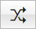
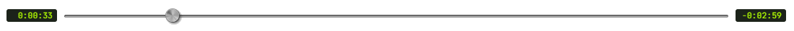

# User Interface

## Source selection

Toggles between using the app's own media player or your microphone as the audio source for the analyzer.

If your sound card and operating system support *Stereo mix* mode, it should also appear as an input device option when you set the Source to **MIC.** 
*Stereo mix* allows audioMotion to receive audio generated by any program running in your PC.

?> When Source is set to **MIC**, output to the speakers is automatically turned off to prevent feedback loop. If you're using headphones you can safely turn it back on, in order to hear the microphone audio. (See [Speakers and Volume](#speakers-and-volume))

## Player controls

These are your standard media control buttons.

| button | action |
|:------:|:-------|
 | Play / pause
 | Previous track - Hold to rewind
 | Stop playback and reset the queue pointer to the first song
 | Next track - Hold to fast forward
 | Shuffle queue and start playback
 | When active, queue will play on repeat

## Speakers and Volume

The **Speakers** switch enables or disables audio output to your speakers or headphones. Setting it to OFF prevents feedback loops from the microphone, for example (see [Source selection](#source-selection)).

Hover the mouse over the **Volume** knob and use the **mouse wheel** to turn the volume up or down (if the scroll direction doesn't feel natural to you, invert its behavior in [Configuration > General settings](configuration.md#invert-scroll-direction-for-volume-control)).

Volume can also be adjusted with the **Up** and **Down** arrow keys.

## Track Progress Bar

The elapsed and remaining time of the current track are displayed to the left and right of the progress bar, respectively.

You can drag the progress bar cursor to fast forward or rewind, or click anywhere on the bar to quickly jump to the relative position on the track.

## Main function buttons

### Panel selection

Buttons on the left open the [**Media Panel**](media-panel.md), the [**Settings panel**](settings.md), the [**Advanced panel**](advanced.md) or the [**Console**](console.md).

At the center, the  button collapses or expands the front panel.
When collapsed, the analyzer area is increased to use most of the screen.

Buttons on the right enable the PIP and Fullscreen functionalities (detailed below) and provide access to the [**Configuration Panel**](configuration.md) and the [**Help Panel**](help.md).

### Picture-In-Picture (PIP)

Click the **PIP** button to open the analyzer display in a floating window that remains on top of other windows. The aspect ratio of the PIP window can be configured in [**Configuration > General settings**](configuration.md#pip-aspect-ratio).

Please note that only the spectrum analyzer graphics are displayed in the PIP window, but no other images or videos.

### Fullscreen

Click the **Fullscreen** button to display audioMotion in fullscreen.
While in fullscreen, you won't be able to access to the app's front panel, but several settings and functionalities are available via [keyboard shortcuts](help.md).

Press **ESC** or **F** while in fullscreen to return to windowed mode.
