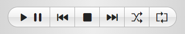

# User Interface

## Main controls

### Audio source

Select *Microphone* to visualize audio from your microphone instead of the music player.

Microphone input is only accessible to the browser in a secure context, i.e., if you're accessing audioMotion via localhost, local file (open index.html directly) or HTTPS protocol.

If your sound card supports *Stereo mix* mode, this should be listed as an input device when access to your microphone is requested.
The *Stereo mix* input allows audioMotion to read audio generated by any program running in your PC.

Please note that the visualization from microphone or stereo mix audio might suffer from a slight delay.

### Player controls

You can use the player controls to play, pause and skip through queued songs.

The **Shuffle** button shuffles the queue and starts playing it from the beginning.

When the **Repeat** option is active, the player will loop back to the first song after playing the entire queue.

### Fullscreen mode and keyboard shortcuts

Click the **Fullscreen Analyzer** button, or press the **F** key, to display the spectrum analyzer in fullscreen.

You can use the keyboard shortcuts below to control the player and change some settings without leaving fullscreen:

| keys | alternate | action |
|------|-----------|--------|
**Left** / **Right** | **J** / **K** | play previous / next song
**Space** | | play / pause
**Up** / **Down** | **Shift+G** / **G** | select previous / next gradient
**A** | | cycle through auto gradient and random mode options
**Shift+B** / **B** | | select previous / next background option
**D** | | display current song info - press again for settings info
**E** | | shuffle play queue
**F** | | toggle fullscreen mode
**H** | | toggle FPS display
**I** | | toggle song info display on track change
**L** | | toggle LED effect on analyzer bars
**Shift+M** / **M** | | select previous / next visualization mode
**Shift+N** / **N** | | reduce / increase analyzer sensitivity
**O** | | toggle low-resolution mode
**P** | | toggle peaks display
**R** | | toggle play queue repeat
**S** | click on analyzer | toggle frequency scale display
**T** | | toggle flat text option
**U** | | toggle luminance bars effect
**Shift+X** / **X** | | select previous / next reflex style

## User Interface Panels

Panels are accessed by clicking the **Settings**, **Files**, **Console** and **Config** tabs.

### Settings Panel

#### Preset

The **Full resolution**, **Octave bands** and **LED bars** presets adjust the settings to recommended values for the discrete frequencies and octave bands visualization modes, with optional LED effect mode.

You can tweak any options and save a favorite configuration by clicking the **Save** button. You can later revert to this configuration by loading the **Custom** preset.

Additionally, your last used configuration will be automatically saved, and restored every time you open audioMotion.
You can manually load the **Last session** preset to undo any changes made during the current session.

The **Restore defaults** preset resets all options to their initial values as in the first time you run audioMotion.

#### Gradient

Several options of color gradients for the analyzer bars. You can change gradients with the **Up** and **Down** arrow keys, or alternatively, **G** and **Shift + G** keys.

If the **AUTO** switch is on, the next gradient will be selected on track change, cycling through the available gradients.
When [Random mode](#random-mode) is active, a random gradient will be selected on every change.

#### Background

Selects the analyzer background.

- **Gradient default** uses the background color defined by the currently selected gradient - this option also shows the unlit LEDs when the [LED effect](#mode) is on;
- **Black** uses a black background;
- The **Album cover** options display the album cover for the current song, either centered on canvas, repeating or adjusted (zoomed) to fill the canvas.

The album covers are retrieved from the songs' metadata. When a picture is not found in the metadata, **audioMotion** will look for a file named
*cover* or *folder* (with a jpg, png, gif or bmp extension) in the song's folder.

#### Cover image dim

Adjusts the intensity of the background image, when [Background](#background) is set to one of the *Album cover* options.

#### Reflex

Selects a reflection style for the analyzer. This setting has no effect when the [LUMI](#mode) switch is active.

#### Analyzer switches

+ **INFO** toggles the on-screen display of song information on every track change
+ **SCALE** toggles the display of the frequency scale on the X-axis
+ **PEAKS** shows amplitude peaks for each frequency

Performance-related options:

+ **FLAT** applies an outline instead of shadow on text displayed on canvas - may improve performance, depending on your graphic card and browser
+ **LO-RES** reduces canvas resolution to improve rendering speed (especially useful for 4K+ displays)
+ **FPS** displays current framerate at the top right corner

The underlined character in each switch label indicates its keyboard shortcut, when available.

#### Mode

Selects the visualization mode.

+ **Discrete frequencies** mode allows you to visualize individual frequencies provided by the [FFT](https://en.wikipedia.org/wiki/Fast_Fourier_transform);
+ **Area graph** displays the same frequency data as above, but as a filled area graph;
+ **Line graph** connects all the discrete frequency points in a continuous line and allows you to customize the line width and fill opacity;
+ **Octave bands** modes display wider vertical bars, each one representing the *n*th part of an octave, based on a [24-tone equal tempered scale](https://en.wikipedia.org/wiki/Quarter_tone).

You can also select the visualization mode using the **M** and **Shift + M** keyboard shortcuts.

Switches:

+ **LEDS** toggles the vintage LED effect for the analyzer bars *(octave bands modes only)*
+ **LUMI** toggles the luminance bars effect - analyzer bars are displayed always at full-height, varying their luminance instead *(octave bands modes only)*

#### Random Mode

The visualization mode and some options may be randomized on track change or time interval.

You can choose which options may be changed by random mode in the Config panel. If the [AUTO](#gradient) switch is active, the gradient will be randomized as well.

#### Frequency Range

The lowest and highest frequencies you want to see in the graphic spectrum analyzer. You can use this feature to "zoom in" a specific frequency range.

#### FFT Size

Number of samples used for the [Fast Fourier Transform](https://en.wikipedia.org/wiki/Fast_Fourier_transform) performed by the analyzer.

Higher values provide greater detail in the frequency domain (especially for low frequencies), but less detail in the time domain (slower response to changes),
so you may also want to adjust the [Smoothing](#smoothing) if changing this.

#### Smoothing

Average constant used to smooth values between analysis frames.

Lower values make the analyzer react faster to changes, and may look better with faster tempo songs and/or larger [FFT sizes](#fft-size).
Increase it if the animation looks too "jumpy".

#### Sensitivity

Adjusts the analyzer sensitivity to improve the visualization of songs too quiet or too loud. You can also use the **N** and **Shift + N** keyboard shortcuts.

The presets can be customized in the [Config Panel](#config-panel).

### Files Panel

#### File explorer

The file explorer allows you to navigate through the music folder shared by the server.

Double-click a music file or playlist to quickly add it to the queue. Press *Ctrl* to select multiple files, or *Ctrl*+*Shift* to select a range of files.

Click the **Add selected** button to add selected files to the queue, or the **Add all files** button to enqueue all music files in the current folder.

You can also drag and drop files from the file explorer into the play queue.

Supported extensions are flac, m4a, mp3, ogg and wav for music files, and m3u or m3u8 for playlists. Codec support may vary, depending on your web browser and operating system.

#### Play queue and playlists

Double-click a queued song to play it.

You can drag and drop queued songs to reorder them. Press *Ctrl* to select multiple files, or *Ctrl*+*Shift* to select a range.
Press *Delete* (*Backspace* on Mac) to remove selected songs from the queue.

**Clear** clears the queue. **Save as...** saves the queue as a new local playlist, stored in your browser's local storage.

Saved playlists appear in the playlist selection box. Select a playlist and click the  button to load it into the queue.
Press the  button to update the selected playlist with the current queue contents.
Press the  button to permanently deleted the selected playlist.

### Console

The console records several useful information, like audio and video settings, configuration changes and error messages.

### Config Panel

#### Enabled Visualization Modes

Allows you to disable undesired visualization modes. Unchecked modes won't be available for manual selection or random mode.

#### Enabled Gradients

Allows you to disable undesired color gradients. Unchecked gradients won't be available for manual selection or random mode.

#### Random Mode options

Allows you to customize which options may be changed when the visualization mode is randomized.

#### Sensitivity presets

Allows you to customize the low, normal and high sensitivity presets. **0** dB represents the loudest possible sound volume.
